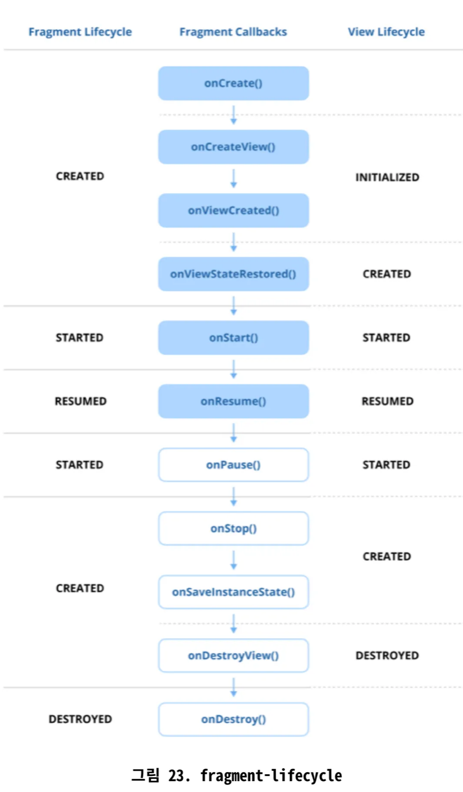

# 0. 안드로이드란 무엇인가?

- 스마트폰과 테블릿 같은 모바일 기기를 위해 설계된 오픈소스 운영체제
- 리눅스 커널 기반

<aside>

### 💡 안드로이드 OS의 특징

1. 오픈 소스 및 커스텀화
2. SDK를 이용한 애플리케이션 개발
3. 풍부한 앱 생태계
4. 멀티태스킹 및 리소스 관리: 멀티태스킹 지원, 여러 앱 동시에 실행 가능.
5. 다양한 하드웨어 지원
</aside>

## 안드로이드 아키텍처

- 안드로이드는 여러 계층으로 이루어진 정교한 소프트웨어 스택 구조
1. **애플리케이션 계층**
    - 전화, 연락처 등의 기본적인 시스템 앱과 사용자가 설치한 써드파티 앱이 위치하는 최상위 계층
2. **애플리케이션 프레임워크 계층(JAVA/Android API Framework)**
    - 안드로이드 앱 개발자들이 가장 많이 사용하는 계층.
    - Activity Manager, Content Provider, View System 등 앱 개발에 필요한 핵심적인 API 제공.
    - 개발자가 하부 구조를 몰라도 쉽게 앱의 기능을 구현할 수 있게 해주는 ‘개발자 도구상자’와 같음.
3. **네이티브 C/C++ 라이브러리**
    - 그래픽 처리를 위한 OpenGL ES, 데이터베이스를 위한 SQLite, 웹 랜더링을 위한 Webkit 등 C/C++로 작성된 핵심 라이브러리 포함
4. **안드로이드 런타임(ART) 및 코어 라이브러리**
    - 안드로이드 앱의 실행 환경. 앱의 바이트코드를 해석하고 실행.
    - AOT(Ahead-Of-Time) 컴파일 방식을 통해 앱 실행 속도와 효율성 높임(이전에는 JIT 방식의 Dalvik VM 사용)
    - 코어 라이브러리는 데이터 구조, 파일 조작, 스레딩 등을 위한 필수 API 제공
5. **하드웨어 추상화 계층(HAL)**
    - 애플리케이션 프레임워크와 하드웨어 드라이버 사이의 ‘번역기’ 역할
    - 하드웨어가 다르더라도 일관된 방식으로 하드웨어 제어 가능.
6. **리눅스 커널**
    - 하드웨어와 직접 통신하는 기반
    - 전원 관리, 메모리 관리, 프로세스 관리, 보안, 드라이버 등 시스템의 가장 핵심적인 기능 담당

## 주요 특징

- 안드로이드 앱은 독립적으로 실행될 수 있는 4대 컴포넌트의 조합으로 구성
    - Activity / Service / Broadcast Receiver / Content Provider
    - 시스템이 앱의 생명주기를 관리하고 리소스를 효율적으로 사용

## 실전 질문

- 안드로이드 아키텍처는 여러 계층으로 구성됩니다. 이 구성 요소들이 애플리케이션 실행과 하드웨어와의 상호작용을 위해 어떻게 작동하는지 설명해주세요.

# 1. 인텐트(Intent)란 무엇인가요?

- Activity, Service, BroadcastReceiver와 같은 안드로이드 컴포넌트들이 서로 통신할 수 있도록 하는 메시징 객체
- 안드로이드 앱의 4대 컴포넌트들은 서로 독립적으로 동작하기 때문에, 컴포넌트 간의 통신과 활성화를 위해 인텐트라는 매개체를 사용
- 인텐트는 크게 2가지 유형으로 나뉨
    
    ### **명시적 인텐트**
    
    - 호출할 대상 컴포넌트(클래스)를 명확하게 지정하여 호출. 주로 **같은 앱 내부에서 컴포넌트 간에 통신할 때 사용**(ex. 로그인 액티비티에서 메인 액티비티를 실행하는 경우)
    - 다른 앱의 컴포넌트를 호출할 수 없으므로 보안성이 높고 직관적
    
    ```kotlin
    // MainActivity에서 DetailActivity를 시작하고 'id'라는 이름으로 데이터 전달
    // 보내는 쪽: MainActivity.kt
    val intent = Intent(this, DetailActivity::class.java)
    intent.putExtra("id", 123)
    startActivity(intent)
    
    // 받는 쪽: DetailActivity.kt
    override fun onCreate(savedInstanceState: Bundle?) {
        super.onCreate(savedInstanceState)
        val id = intent.getIntExtra("id", 0) // 기본값 0
    }
    ```
    
    ### **암시적 인텐트**
    
    - 수행할 행동과 데이터를 지정하여 시스템에 요청하는 방식
    - 시스템은 해당 인텐트를 받아들일 수 있는 컴포넌트를 모든 앱에서 찾음. 만약 여러 개의 컴포넌트가 발견되면 사용자에게 선택지를 제공하거나 우선순위에 따라 하나를 실**행**
    - **인텐트 필터(Intent filter)**: 각 앱은 AndroidManifest.xml에 인텐트 필터를 등록, 자신의 컴포넌트가 어떤 종류의 암시적 인텐트를 처리할 수 있는지 시스템에 알림. 인텐트 필터는 <action>, <data>, <category> 세 가지 요소로 구성
    
    ```kotlin
    // ex1. 웹 브라우저 열기
    val webUrl = "https://www.google.com"
    val intent = Intent(Intent.ACTION_VIEW, Uri.parse(webUrl))
    startActivity(intent)
    
    // ex2. 다른 앱으로 텍스트 공유하기
    val sendIntent: Intent = Intent().apply {
        action = Intent.ACTION_SEND
        putExtra(Intent.EXTRA_TEXT, "이것은 공유할 텍스트입니다.")
        type = "text/plain"
    }
    
    // 항상 앱 선택창(Chooser)을 띄워서 사용자에게 선택권을 줌
    val shareIntent = Intent.createChooser(sendIntent, "공유할 앱을 선택하세요")
    startActivity(shareIntent)
    ```
    

# 2. PendingIntent란 무엇인가요?

- 다른 애플리케이션이나 시스템 컴포넌트가 애플리케이션을 대신하여 미리 정의된 인텐트를 나중에 실행할 수 있는 권한을 부여하는 또다른 종류의 인텐트. 앱의 수명 주기를 벗어나 트리거되어야 하는 작업에 특히 유용하며, 알림이나 서비스와의 상호작용과 같은 경우에 사용
- 지금 당장 실행할 것이 아니라, 미래의 특정 시점에 다른 앱이나 시스템이 내 앱의 권한을 가지고 실행할 수 있도록 **‘실행 예정인 인텐트’**를 포장하여 전달하는 역할

## 특징

- 일반 인텐트의 래퍼(wrapper) 역할을 하여 앱의 생명 주기를 넘어서 지속되도록 함.
- 현재 앱과 동일한 권한으로 다른 앱이나 시스템 서비스에 인텐트 실행 위임.
- Activity, Service, Broadcast를 위해 생성
- 동작 방식과 상호 작용 방식을 제어하는 다양한 플래그 지원
    - `FLAG_UPDATE_CURRENT`: 기존 pendingIntent를 새 데이터로 업데이트
    - `FLAG_CANCEL_CURRENT`: 새 PendingIntent를 만들기 전에 기존 것 취소
    - `FLAG_IMMUTABLE`: 변경 불가능하게 만들어 수신자가 수정하는 것을 방지. Android 12부터  특히 중요
    - `FLAG_ONE_SHOT`: PendingIntetnt가 한 번만 사용될 수 있도록 보장

## 사용 사례

- 알림(Notifications): 사용자가 알림을 탭했을 때 Activity를 여는 등의 작업 허용
    
    ```kotlin
    val notificationManager = getSystemService(Context.NOTIFICATION_SERVICE) as NotificationManager
    
    // 알림 클릭 시 실행될 인텐트
    val intent = Intent(this, MainActivity::class.java)
    
    // 인텐트를 PendingIntent로 포장
    val pendingIntent = PendingIntent.getActivity(
        this,
        0, // requestCode
        intent,
        PendingIntent.FLAG_IMMUTABLE // Flag
    )
    
    // 알림 빌더에 PendingIntent 설정
    val builder = NotificationCompat.Builder(this, CHANNEL_ID)
        .setContentTitle("알림 제목")
        .setContentText("알림 내용입니다.")
        .setSmallIcon(R.drawable.ic_notification)
        .setContentIntent(pendingIntent) // 사용자가 탭하면 pendingIntent 실행
        .setAutoCancel(true) // 탭하면 알림 자동 삭제
    
    notificationManager.notify(1, builder.build())
    ```
    
- 알람(Alarms): AlarmManager를 사용하여 작업 예약
    
    ```kotlin
    val alarmManager = getSystemService(Context.ALARM_SERVICE) as AlarmManager
    val intent = Intent(this, MyBroadcastReceiver::class.java)
    
    val pendingIntent = PendingIntent.getBroadcast(
        this,
        1, // requestCode
        intent,
        PendingIntent.FLAG_IMMUTABLE
    )
    
    // 10초 후에 알람이 울리도록 설정
    val triggerTime = System.currentTimeMillis() + 10 * 1000
    alarmManager.set(AlarmManager.RTC_WAKEUP, triggerTime, pendingIntent)
    ```
    
- 서비스(Services): 백그라운드 작업을 위해 ForegroundService 또는 BroadcastReceiver에 작업 위임

## 보안 고려 사항

- 악의적인 앱이 기본 인텐트를 수정하는 것을 방지하기 위해 항상 `FLAG_IMMUTABLE` 설정해야 함.

# 3. Serializable과 Parcelable의 차이점은 무엇인가요?

- **`Serializable(S)`**과 **`Parcelable(P)`**은 둘 다 **객체를 다른 컴포넌트로 전달하거나 저장할 수 있는 형태로 변환(직렬화)**하기 위해 사용하는 인터페이스

- **`Serializable`**
    - 자바 표준 인터페이스
    - **리플렉션**을 사용하여 객체를 바이트 스트림으로 변환.
        - 리플렉션이 느린 프로세스이기 때문에 느림
    - 구현이 간편
    - 직렬화 중에 많은 임시 객체를 생성하려 메모리 오버헤드 증가

- **`Parcelable`**
    - 안드로이드 SDK 전용 인터페이스
        - 고성능 프로세스간 통신(IPC)을 위해 특별히 설계
    - 개발자가 직접 직렬화 로직 작성하여 객체를 **`Parcel`**이라는 컨테이너에 담음.
        - `parcel`은 범용 직렬화 도구가 아니며 영구 저장에 사용 X
    - 성능이 뛰어남
- **`P`**는 성능이 중요한 안드로이드 데이터 전달, 특히 IPC나 액티비티 또는 서비스 간 데이터 전달에 선호
- 최신 안드로이드 개발에서는 kotlin-parcelize 플러그인이 `@Parcelize` 어노테이션을 사용하여 단순화
    - `writeToParcel`과 같은 메서드를 재정의하거나 `CREATOR`를 구현할 필요X
- `Serializable` 구현
    
    ```kotlin
    import java.io.Serializable
    
    data class User(val id: Int, val name: String) : Serializable
    ```
    
- `Parcelable` 구현(`@Parcelize`)
    
    ```kotlin
    import android.os.Parcelable
    import kotlinx.parcelize.Parcelize
    
    @Parcelize
    data class User(val id: Int, val name: String) : Parcelable
    ```
    
- `Serializable`이 느린데도 굳이 사용해야하는 경우가 있는가?
    - Yes. 데이터를 파일로 저장하거나 네트워크를 통해 다른 서버로 전송해야 할 때
    - `parcelable`은 안드로이드 IPC를 위해 설계되어 다른 플랫폼과 호환되지 않지만, `Serializable`은 자바 표준이므로 플랫폼 독립적인 데이터 직렬화 가능
- `Serializable`의 `serialVersionIUID`란?
    - 직렬화된 객체의 버전을 관리하는 ID.
    - 클래스 구조가 변경되었을 때 데이터의 호환성 문제를 방지

# 4. Context란 무엇이며 어떤 유형의 Context가 있나요?

- Context는 애플리케이션의 현재 상태와 환경에 대한 정보를 담고있는 인터페이스.
- 앱의 리소스에 접근하거나, 안드로이드 시스템 서비스를 호출하거나, 액티비티를 시작하는 등 앱의 구성 요소를 작동시키는 데 필요.
- 안드로이드에서 무언가 실행하려면, 시스템은 “어떤 애플리케이션이, 어떤 환경에서 이 작업을 요청하는가?”를 알아야 하는데 Context가 해당 정보를 제공
- **잘못된 Context를 사용하면 메모리 누수가 발생하므로 용도에 맞게 사용하는 것이 중요**

## Application Context

- getApplicationContext()를 호출하여 획득 가능
- Activity의 생명주기를 벗어나 오랫동안 유지되어야 하는 객체에서 Context가 필요할 때 사용.
- 사용사례
    - SharedPreferences나 데이터베이스와 같은 애플리케이션 전체 리소스 접근
    - 전체 앱 생명주기 동안 지속되어야 하는 BroadcastReceiver 등록
    - 앱 생명주기 동안 유지되는 라이브러리나 컴포넌트 초기화 등
- 싱글톤 클래스 초기화: 싱글톤 객체가 Activity Context를 참조하면, Activity가 종료되어도 가비지 컬렉터가 Activity를 수거하지 못해 메모리 릭 발생
    
    ```kotlin
    // 메모리 릭을 유발하는 잘못된 예
    class MySingleton private constructor(context: Context) {
        // Activity Context를 저장하면 Activity가 종료되도 참조가 남아 메모리 릭 발생
        private val mContext = context 
    
        companion object {
            private var instance: MySingleton? = null
            fun getInstance(context: Context): MySingleton {
                return instance ?: MySingleton(context).also { instance = it }
            }
        }
    }
    
    // 메모리 릭을 방지하는 올바른 예
    class MySingleton private constructor(context: Context) {
        // Application Context는 앱이 종료될 때까지 살아있으므로 안전
        private val mContext = context.applicationContext
    
        companion object {
            // ... 동일 ...
        }
    }
    ```
    

## Activity Context

- Activity의 생명주기와 밀접하게 연관된, UI와 관련된 작업을 할 때 사용
    - `Toast`, `Dialog`, `Snackbar` 등 사용자에게 무언가를 보여줄 때
    - `LayoutInflater`를 이용해 뷰를 생성할 때
    - 다른 Activity를 시작할 때
    - 현재 Activity 범위에 있는 리소스나 테마에 접근할 때

```kotlin
// Toast 메시지 띄우기 (Activity의 테마와 윈도우 정보가 필요)
Toast.makeText(this, "Activity Context 사용", Toast.LENGTH_SHORT).show()

// Dialog 띄우기
AlertDialog.Builder(this) // `this`는 Activity Context
    .setMessage("정말 종료하시겠습니까?")
    .setPositiveButton("예", null)
    .show()
```

## Service Context

- Service의 생명주기와 연결
- 네트워크 작업 수행이나 음악 재생과 같은 백그라운드에서 실행되는 작업에 사용
- Service에 필요한 시스템 수준 서비스에 대한 접근을 제공

## Broadcast Context

- `BroadcastReceiver`가 호출될 때 제공
- 수명이 짧으며 일반적으로 특정 브로드캐스트에 응답하는 데 사용
- 장기적인 테스크를 수행하는 데는 적합하지 않음

## Context의 일반적인 사용사례

Context는 다음과 같은 다양한 작업에 사용됩니다:

- **리소스 접근**: `getString()` 또는 `getDrawable()`과 같은 메서드를 사용하여 문자열, 드로어블, 치수와 같은 리소스에 접근합니다.
- **레이아웃 인플레이션**: `LayoutInflater`를 사용하여 XML 레이아웃을 뷰로 인플레이션합니다.
- **액티비티 및 서비스 시작**: `startActivity()`와 `startService()`를 시작하려면 Context가 필요합니다.
- **시스템 서비스 접근**: `getSystemService()`를 통해 `ClipboardManager` 또는 `ConnectivityManager`와 같은 시스템 수준 서비스에 접근합니다.
- **데이터베이스 및 SharedPreferences 접근**: `SQLite` 데이터베이스나 `SharedPreferences`와 같은 영구 저장 메커니즘에 접근하는 데 사용됩니다

### Gemini

### 🧐 사용 사례별 Context 분석

| 사용 사례 | 주로 사용되는 Context | 설명 |
| --- | --- | --- |
| **1. 리소스 접근**
`getString()`, `getDrawable()` | **Activity Context** (주로), Application Context | 대부분 UI에 표시할 리소스를 가져오므로 **Activity Context**가 자연스럽습니다.
하지만 테마(Theme)의 영향을 받지 않는 단순 리소스는 Application Context로도 접근 가능합니다. |
| **2. 레이아웃 인플레이션**
`LayoutInflater` | ✅ **Activity Context** | **반드시 Activity Context를 사용해야 합니다.**
레이아웃을 화면에 그리기 위해서는 현재 화면의 테마(Theme)와 스타일(Style) 정보가 필요한데, 이 정보는 Activity Context에만 포함되어 있습니다.
Application Context를 사용하면 앱이 다운되거나 테마가 적용되지 않은 이상한 UI가 보일 수 있습니다. |
| **3. 액티비티 및 서비스 시작**
`startActivity()`, `startService()` | **상황에 따라 다름** | • **`startActivity()`**: **Activity Context**를 사용하는 것이 일반적입니다.
만약 Service나 BroadcastReceiver 등 UI가 없는 곳에서 Activity를 시작하려면, 새로운 Task를 만들어야 하므로 `Intent.FLAG_ACTIVITY_NEW_TASK` 플래그를 추가하고 **Application Context**를 사용해야 합니다. 
• **`startService()`**: 어떤 Context에서든 호출할 수 있습니다. |
| **4. 시스템 서비스 접근**
`getSystemService()` | **상황에 따라 다름** | • **UI 관련 서비스** (`WindowManager`, `LayoutInflater` 등): **Activity Context**를 사용합니다.
• **앱 전반에 걸친 서비스** (`ConnectivityManager`, `NotificationManager` 등): **Application Context**를 사용하는 것이 메모리 누수 방지에 안전합니다. |
| **5. 데이터베이스 및 SharedPreferences 접근** | ✅ **Application Context** | 데이터베이스나 SharedPreferences는 특정 화면이 아닌 앱 전체에서 사용되는 데이터 저장소입니다.
따라서 앱의 생명주기(Application)를 따르는 **Application Context**를 사용해야 합니다.
Activity Context를 여기에 전달하면 해당 Activity가 종료되어도 가비지 컬렉터(GC)가 수거하지 못해 **메모리 누수(Memory Leak)의 주된 원인**이 됩니다. |

---

### 💡 각 Context의 특징 요약

1. **Activity Context**
    - **생명주기**: Activity의 생명주기와 동일합니다. (Activity가 `onDestroy()` 되면 소멸)
    - **특징**: UI와 관련된 거의 모든 작업을 할 수 있습니다. (테마 포함, 다이얼로그 생성, 레이아웃 인플레이션 등)
    - **주의**: 수명이 짧으므로, Activity보다 오래 살아남는 객체에 Activity Context를 전달하면 안 됩니다. (메모리 누수 발생)
2. **Application Context**
    - **생명주기**: 애플리케이션의 생명주기와 동일합니다. (앱 프로세스가 종료될 때 소멸)
    - **특징**: 앱 전역에서 사용할 수 있는 싱글톤(Singleton) 객체입니다. UI와 직접적인 관련이 없는 작업에 적합합니다.
    - **제한**: 테마가 없으므로 레이아웃 인플레이션 등 UI 관련 작업에 사용하면 안 됩니다.
3. **Service Context / BroadcastReceiver Context**
    - **Service Context**: Service의 생명주기를 따릅니다. Activity Context와 유사한 점이 많지만, UI 작업에는 제약이 있습니다.
    - **BroadcastReceiver Context**: `onReceive()`가 호출될 때만 유효하며, 이 메서드가 끝나면 소멸하는 매우 짧은 생명주기를 가집니다. UI 작업(다이얼로그 등)이나 서비스 바인딩과 같은 긴 작업은 불가능합니다.

## Context 사용 시 주의사항

- Context에 대한 오랜 참조 피하기 - 메모리 누수
- 소멸된 컴포넌트의 Context 사용 피하기
- 백그라운드 스레드에서 Context 사용 피하기: Context는 메인 스레드용으로 설계되었음.
    - **백그라운드에서 작업하는 도중에 UI 관련 Context 리소스와 상호작용이 필요하다면, 반드시 메인스레드로 다시 전환할 것**
- 리스너 및 콜백 등록 올바르게 해제하기

## ContextWrapper

- Context 객체를 감싸서 래핑된 Context에 대한 호출을 위임하는 기능 제공
- 기존 Context의 특정 동작을 개선시키거나 재정의해야할 때 사용
- 사용사례
    - 커스텀 컨텍스트 생성
    - 동적 리소스 처리
    - 의존성 주입

## Activity에서 this와 baseContext의 차이점은?

- **범위(Scope)**: `this`는 현재 `Activity` 인스턴스와 그 생명주기를 나타내고, `baseContext`는 `Activity`가 구축된 저수준의 Context를 참조
- **사용법(Usage)**: `this`는 Activity의 생명주기나 UI와 관련된 작업에 주로 사용되며, `baseContext`는 `Context`의 핵심 구현체와 상호 작용할 때, 특히 커스텀 `ContextWrapper` 시나리오에서 사용
- **계층(Hierarchy)**: `baseContext`는 `Activity`의 기반 Context이며, `baseContext`에 접근하면 `Activity`가 `ContextWrapper`로서 제공하는 추가 기능을 우회적으로 접근 가능

## getBaseContext()와 getApplicationContext()의 차이는 무엇인가?

- `getApplicationContext()`는 앱의 싱글턴 `Application` 인스턴스를 반환하는 반면, `getBaseContext()`는 `ContextWrapper`가 감싸고 있는 실제 `Context`를 반환합니다.
- `Activity`도 `ContextWrapper`의 일종이므로, 일반적으로 `Activity` 내에서 `getBaseContext()`는 `Activity` 자신을 가리킵니다.

# 5. Application 클래스란 무엇인가요?

- 앱의 프로세스가 시작될 때 가장 먼저 생성되는 기본 클래스로, 앱의 전체 생명주기동안 유지되는 전역 상태를 관리하는 데 사용.
- 여러 컴포넌트가 공유해야하는 데이터나 초기화 로직을 담는 데 최적화되어 있음.
- `AndroidManifest.xml` 파일에 커스텀 클래스를 지정하지 않는 한 Application 클래스의 기본 구현체 사용
- 주요 사용 사례
    - 전역 리소스 관리: `Room DB`, `SharedPreferences` 또는 `Retrofit` 클라이언트와 같은 리소스를 초기화하고, 애플리케이션 전역에 걸쳐서 재사용 가능
    - 컴포넌트 초기화: `Firebase Analytics`, `Timber` 등과 같이 앱 생명주기 전역에서 사용되는 도구 설정
    - 의존성 주입: `Dagger`/`Hilt` 같은 프레임워크 초기화하여 앱 전체에 의존성 제공
- `Application`의 생명주기는 매우 단순하여, 앱의 '프로세스'와 생명을 같이 합니다. 즉, 프로세스가 시작될 때 `onCreate()`가 호출되고 프로세스가 종료될 때 소멸합니다. `onTerminate()` 메소드가 있지만, 실제 기기에서는 거의 호출되지 않는다고 생각해야 합니다.

## 커스텀 Application 클래스 사용방법

### 1. 커스텀 Application 클래스 생성

```kotlin
import android.app.Application

// 1. Application 클래스를 상속받는 커스텀 클래스 생성
class MyApplication : Application() {

    override fun onCreate() {
        super.onCreate()
        // 전역 의존성 초기화
        initializeDatabase()
        initializeAnalytics()
    }
    private fun initializeDatabase() { /* ... */ }
    private fun initializeAnalytics() { /* ... */ }

```

### 2. AndroidManifest.xml에 등록

```kotlin
<?xml version="1.0" encoding="utf-8"?>
<manifest xmlns:android="http://schemas.android.com/apk/res/android"
    package="com.example.myapp">

    <application
        android:name=".MyApplication"
        android:allowBackup="true"
        android:icon="@mipmap/ic_launcher"
        android:label="@string/app_name"
        android:roundIcon="@mipmap/ic_launcher_round"
        android:supportsRtl="true"
        android:theme="@style/Theme.MyApp">

        <activity android:name=".MainActivity">
            ...
        </activity>

    </application>
</manifest>
```

## 주요 메서드

- `onCreate()`
    - 앱 프로세스가 생성될 때 호출되는 첫 번째 메서드
    - 애플리케이션 전체 의존성을 초기화하는 곳
    - 생명주기 동안 단 한 번만 호출
- `onTerminate()`
    - 에뮬레이션된 환경에서 애플리케이션이 종료될 때 호출
    - 안드로이드가 호출을 보장하지 않으므로 실제 기기의 프로덕션 환경에서는 호출되지 않음.
- `onLowMemory(), onTrimMemory()`
    - 시스템이 메모리 부족 상태를 감지할 때 트리거

## 주의사항

- `onCreate()`에서 무거운 태스크 피하기: `onCreate()`는 메인 스레드에서 실행. 시간이 오래 걸리는 작업을 수행하면 앱의 시작 시간이 길어져 사용자 경험을 해침.
- God Object로 만들지 말 것: 전역 초기화 및 리소스 관리에만 집중하는 것이 좋음.
- 스레드 안정성 보장: 앱 전반에 걸쳐서 사용되어야 하는 공유 리소스에 대해서는 스레드 안정성을 보장해야 함.
- 영구 저장소로 착각 X: 사용자가 앱을 오랫동안 사용하지 않거나 시스템 메모리가 부족하면 안드로이드 시스템이 언제든지 앱 프로세스를 종료할 수 있음. 중요한 데이터는 `SharedPreferences`나 데이터베이스 같은 영구 저장소에 보관

# 6. AndroidManifest 파일의 목적은 무엇인가요?

- 안드로이드 OS에 애플리케이션에 대한 필수 정보를 정의하는 핵심 구성 파일. 앱의 컴포넌트, 권한, 하드웨어 및 소프트웨어 기능 등 애플리케이션의 “인적사항”을 OS에 알려줌.
- 앱의 정체성을 정의하고, 시스템 및 구글 플레이 스토어와 소통하는 핵심적인 창구

## 주요 기능(역할)

1. 애플리케이션 컴포넌트 선언
    - 시스템이 앱의 컴포넌트를 인식하고 실행하려면 반드시 매니페스트에 선언되어야 함.
    - <activity>: 앱의 화면 하나하나를 정의
    - <service>: 백그라운드에서 실행되는 작업 정의
    - <receiver>: 시스템의 특정 방송을 수신하는 컴포넌트 정의
    - <provider>: 다른 앱과 데이터를 공유하기 위한 컴포넌트 정의
2. 권한 정의
    - <uses-permission>: 인터넷 사용, 카메라 접근, 위치 정보 등 민감한 기능에 접근하기 위해 사용자에게 허락받아야 할 권한 명시
    - <permission>: 앱의 자체적인 컴포넌트나 데이터를 보호하기 위해 새로운 권한 직접 정의할 수도 있음
3. 하드웨어/소프트웨어 기능 명시
    - <uses-feature>: 앱이 작동하는데 필요한 하드웨어(예: 카메라, GPS)나 소프트웨어(예: 특정 버전의 그래픽 라이브러리)를 선언. 구글 플레이 스토어는 이 정보를 바탕으로 해당 기능을 지원하지 않는 기기 필터링
4. 앱의 기본  정보 정의
    - <manifest>: 파일의 최상위 요쇼로, package 속성을 통해 앱의 고유한 ID(패키지명) 정의
    - <application>: 아이콘, 앱 이름, 테마 등 앱 자체에 대한 전반적인 속성 설정
    - 앱의 버전, 최소 및 대상 API 레벨 등의 필수 정보 제공
5. 인텐트 필터 정의
    - 어떤 종류의 인텐트에 응답할 수 있는지 명시
6. 앱 구성 및 설정
    - 메인 런처 액티비티 정의, 백업 동작 구성, 테마 지정과 같은 구성 포함.
    - 앱의 동작 방식과 표시 방식을 제어하는 데 도움이 됨.

## 심화 질문

### android:exported 속성은 무엇이며 왜 중요한가?

- exported 속성은 해당 컴포넌트를 다른 앱에서 호출할 수 있는지 여부를 결정하는 보안 설정.
- true이면 외부 호출 가능
- 안드로이드 12 부터는 인텐트 필터가 있는 컴포넌트에 이 속성을 명시적으로 설정하도록 의무화됨.
    - 다른 앱이 의도치 않게 내 앱의 내부 컴포넌트를 실행시키는 보안취약점을 막기 위함

### 사용자가 PDF파일을 열려고 할 때 내 앱이 선택지에 나타나게 하려면 manifest에 무엇을 추가해야 할까?

- PDF 파일을 처리할 Activity의 `<intent-filter>`안에, `<action android: android:name=”android.intent.action.VIEW” />`와 `<data android:mimeType=”application/pdf” />`를 추가

# 7. Activity 생명주기를 설명해주세요.

- Activity가 생성되어 소멸하기까지 거치는 일련의 상태 변화
- 안드로이드 시스템은 사용자의 행동이나 시스템 이벤트에 따라 정해진 순서대로 특정 콜백 메소드를 호출하여 상태 전환, 개발자는 콜백 메소드를 재정의하여 각 상태에 맞는 적절한 작업 수행

## 생명주기 콜백 메소드

### onCreate()

- Activity가 처음 생성될 때 단 한 번 호출.
- 액티비티를 초기화하고, UI 컴포넌트를 설정하며, 저장된 인스턴스 상태 복원, 뷰모델 초기화

### onStart()

- Activity가 사용자에게 보이기 직전에 호출
- Activity는 화면에 표시되지만, 아직 사용자와 상호작용할 수는 없는 상태

### onResume()

- Activity가 사용자와 상호작용을 시작하기 직전, 포그라운드에 진입했을 때 호출
- 실행 중 상태에 해당
- 일시 중지되었던 UI 업데이트, 애니메이션 또는 입력 리스너를 재개하는 곳

### onPause()

- 다른 Activity가 위에 나타나 포커스를 잃었을 때 호출
- 아직 화면에 일부 보일 수 있음. 애니메이션을 중지하거나, 아직 저장되지 않은 데이터를 저장하는 등 가벼운 작업 처리해야 함.

### onStop()

- Activity가 사용자에게 완전히 보이지 않게 되었을 때 호출(홈 버튼을 누르거나 다른 액티비티로 완전히 전환된 경우)
- 불필요한 리소스를 해제하는 등 비교적 무거운 정리 작업 처리.

### onRestart()

- onStop() 상태에 있던 Activity가 다시 시작되기 직전에 호출
- 이 메소드 이후에는 항상 onStart()가 호출

### onDestroy()

- Activity가 소멸되기 직전에 호출
- 사용자가 뒤로가기 버튼을 눌러 액티비티를 종료하거나, 화면 회전 같은 구성 변경으로 시스템이 액티비티를 일시적으로 파괴할 때, 시스템이 메모리를 확보하기 위해 프로세스를 종료할 때 호출.
- 모든 리소스를 해제하는 최종 정리 작업 수행


### 핵심 시나리오별 흐름

| 시나리오 | 생명주기 콜백 순서 |
| --- | --- |
| **1. 앱 첫 실행** | `onCreate()` → `onStart()` → `onResume()` |
| **2. 홈 버튼 누름** | `onPause()` → `onStop()` |
| **3. 다시 앱으로 복귀** | `onRestart()` → `onStart()` → `onResume()` |
| **4. 뒤로가기 버튼 누름** | `onPause()` → `onStop()` → `onDestroy()` |
| **5. 화면 회전 (구성 변경)** | `onPause()`→`onStop()`→`onDestroy()`→**`onCreate()`**→`onStart()`→`onResume()` |

## 심화 질문

### 화면 회전 시 데이터가 사라지는 문제를 어떻게 해결해야 하나요?

- 가장 권장되는 현대적인 방법은 ViewModel을 사용하는 것. ViewModel은 Activity의 생명주기와 분리되어 구성 변경 시에도 데이터를 그대로 유지해줌.
- 과거에는 onSaveInstanceState()와 onRestoreInstanceState()콜백을 사용하여 Bundle에 직접 데이터를 저장하고 복원했지만, ViewModel은 이 과정을 더 간단하고 안정적으로 만들어줌.

### onPause()와 onStop()의 실질적인 차이점은 무엇인가?

- 가장 큰 차이점은 가시성.
- 아주 중요하는 빠른 데이터 저장은 onPause()에서, 상대적으로 무거운 리소스 해제는 onStop()에서 처리하는 것이 효율적

### AAC(Android Architecture Components)의 `LifecycleObserver`는 어떻게 생명주기 관리를 도와주나요?

- 생명주기를 감지해야 하는 로직을 Activity나 Farment 외부의 별도 클래스로 분리 가능. Activity 클래스를 더 깔끔하게 유지하고, 코드를 재사용하기 쉽게 만들어줌.
    
    ```kotlin
    // 위치 관련 로직을 별도 클래스로 분리
    class MyLocationObserver(private val context: Context) : DefaultLifecycleObserver {
    
        // Activity/Fragment가 onStart 상태가 되면 자동으로 호출됨
        override fun onStart(owner: LifecycleOwner) {
            super.onStart(owner)
            // 위치 추적 시작 로직
            println("위치 추적 시작!")
        }
    
        // Activity/Fragment가 onStop 상태가 되면 자동으로 호출됨
        override fun onStop(owner: LifecycleOwner) {
            super.onStop(owner)
            // 위치 추적 중지 로직
            println("위치 추적 중지!")
        }
    }
    
    // Activity는 Observer를 등록하기만 하면 됨
    class MapActivity : AppCompatActivity() {
    
        override fun onCreate(savedInstanceState: Bundle?) {
            super.onCreate(savedInstanceState)
    
            // MyLocationObserver를 Activity의 생명주기에 등록
            lifecycle.addObserver(MyLocationObserver(this))
        }
    }
    ```
    
    - `lifecycle.addObserver(...)` 이 한 줄의 코드로 `MapActivity`의 생명주기가 바뀔 때마다 `MyLocationObserver`의 해당 메서드(`onStart`, `onStop` 등)가 **자동으로 호출됩니다.**
    
    ### LifecycleObserver 사용의 장점
    
    - **관심사의 분리(Separation of Concerns)**: Activity는 UI에만 집중하고, 생명주기에 따른 동작은 각 Observer가 알아서 처리합니다.
    - **코드의 재사용성 및 가독성 향상**: `MyLocationObserver`는 다른 Activity나 Fragment에서도 얼마든지 재사용할 수 있으며, Activity 코드가 매우 간결해집니다.
    - **메모리 누수 방지**: 시작과 중지 로직이 한 클래스 안에 모여있어 실수를 줄일 수 있고, `LifecycleOwner`가 소멸(`onDestroy`)될 때 Observer도 자동으로 정리되어 안전합니다.
    - **테스트 용이성**: 생명주기 로직이 분리되어 있어 단위 테스트(Unit Test)가 훨씬 쉬워집니다.

## Activity의 lifecycle 인스턴스

- Activity의 현재 생명주기 상태를 가지고 있고, 이 상태의 변화를 다른 객체들이 관찰할 수 있도록 해주는 객체
- AAC의 일부로 Activity의 생명주기 코드를 더 깔끔하고 안전하게 관리하기 위해 도입

### 주요 구성 요소

1. **`LifecycleOwner`**
    - `getLifecycle()`메소드를 가지는 인터페이스, `Lifecycle` 객체를 소유하고 제공하는 주체
    - Activity와 Fragment는 기본적으로 `LifecycleOwner`를 구현, 내부에서 `lifecycle` 속성에 바로 접근 가능
2. **`LifecycleObserver`**
    - `LifecycleOwner`의 생명주기 변화를 감지, 그에 맞는 동작 수행하는 객체
    - `@OnLifecycleEvent` 어노테이션을 사용해 특정 생명주기 이벤트가 발생했을 때 호출될 메소드 지정 가능
3. **`Lifecycle`**
    - `LifecycleOwner`에 의해 제공, 현재의 생명주기 상태와 최근 발생한 이벤트 정보를 가짐
    - `addObserver()` 메소드를 통해 `LifecycleObserver` 등록, 생명주기가 바뀔 때마다 등록된 관찰자들에게 이벤트 전파

### 장점

- 관심사 분리
- 생명주기 인식, 메모리 릭 방지
- Jetpack 라이브러리와 호환성(LiveData, ViewModel…)
- 재사용성 및 테스트 용이성

# 8. Fragment 생명주기를 설명해주세요

- Fragment가 생성되어 소멸되기까지 거치는 일련의 상태 변화
- 크게 **Fragment 자체의 생명주기**와 **Fragment가 그리는 View의 생명주기**로 나뉨.

- **onAttach()**:
    
    ◦ 프래그먼트가 부모 액티비티와 **처음으로 연결될 때 호출되는 콜백**입니다.
    
    ◦ 이 시점에서 프래그먼트는 Activiy Context와 상호 작용할 수 있습니다.
    
- **onCreate()**:
    
    ◦ 프래그먼트를 **초기화하기 위해 호출**됩니다.
    
    ◦ 이 시점에는 프래그먼트가 생성되었지만, **아직 UI는 생성되지 않았습니다**.
    
    ◦ 일반적으로 필수 컴포넌트를 초기화하거나 저장된 상태를 복원하는 곳입니다.
    
- **onCreateView()**:
    
    ◦ 프래그먼트의 **UI가 처음으로 그려질 때 호출**됩니다.
    
    ◦ 이 메서드에서 프래그먼트 레이아웃의 루트 뷰를 반환합니다. `LayoutInflater`를 사용하여 프래그먼트의 레이아웃을 인플레이션하는 곳입니다.
    
- **onViewCreated()**:
    
    ◦ 프래그먼트의 **뷰가 생성된 후 호출**됩니다.
    
    ◦ 종종 UI 컴포넌트와 사용자 상호 작용 처리에 필요한 로직을 설정하는 데 사용됩니다.
    
- **onViewStateRestored()**:
    
    ◦ 프래그먼트의 뷰 계층이 생성되고 저장된 상태가 뷰에 복원된 후 호출됩니다.
    
- **onStart()**:
    
    ◦ 프래그먼트가 **사용자에게 보이게 되는 상태**입니다.
    
    ◦ 액티비티의 `onStart()` 콜백과 동일하게, 프래그먼트가 활성 상태이지만 아직 포그라운드에 있지는 않습니다.
    
- **onResume()**:
    
    ◦ 프래그먼트가 **완전히 활성 상태이며 포그라운드에서 실행 중**이므로 사용자와 **상호 작용이 가능한 상태**입니다.
    
    ◦ 이 메서드는 프래그먼트의 UI가 완전히 화면에 표시되고 사용자가 상호 작용할 수 있을 때 호출됩니다.
    
- **onPause()**:
    
    ◦ 프래그먼트가 더 이상 포그라운드에 있지 않지만, **여전히 화면에 보이는 경우 호출**됩니다.
    
    ◦ 프래그먼트가 포커스를 잃기 직전이므로, 포그라운드에 없을 때 지속되어서는 안 되는 작업을 일시 중지해야 합니다.
    
- **onStop()**:
    
    ◦ 프래그먼트가 **더 이상 보이지 않을 때 호출**됩니다.
    
    ◦ 프래그먼트가 화면 밖에 있는 동안 지속해야 할 필요가 없는 작업을 중지하는 곳입니다.
    
- **onSaveInstanceState()**:
    
    ◦ 프래그먼트가 소멸되기 전에 UI 관련 상태 데이터를 저장하여 나중에 복원할 수 있도록 호출됩니다.
    
- **onDestroyView()**:
    
    ◦ 프래그먼트의 **뷰 계층이 제거될 때 호출**됩니다.
    
    ◦ 메모리 누수를 방지하기 위해 어댑터를 지우거나 참조를 null로 만드는 등 뷰와 관련된 리소스를 정리해야 합니다.
    
- **onDestroy()**:
    
    ◦ 프래그먼트 **자체가 소멸될 때 호출**됩니다.
    
    ◦ 이 시점에서 모든 리소스를 정리해야 하지만, 프래그먼트는 여전히 부모 액티비티에 연결되어 있습니다.
    
- **onDetach()**:
    
    ◦ 프래그먼트가 부모 액티비티에서 **분리되어 더 이상 연결되지 않는 최종 콜백**입니다.
    
    ◦ 이것이 마지막 콜백이며 프래그먼트의 생명주기가 완료됩니다.
    


### 핵심 시나리오별 흐름

| 시나리오 | 생명주기 콜백 순서 |
| --- | --- |
| **1. Fragment 추가** | `onAttach()`→`onCreate()`→`onCreateView()`→`onViewCreated()`→`onStart()`→`onResume()` |
| **2. 홈 버튼 누름** | `onPause()` → `onStop()` |
| **3. Fragment 교체 (Back Stack 미사용)** | `onPause()`→`onStop()`→`onDestroyView()`→`onDestroy()`→`onDetach()` |
| **4. Fragment 교체 (Back Stack 사용)** | `onPause()` → `onStop()` → **`onDestroyView()`** (Fragment 인스턴스는 메모리에 남아있음) |
| **5. Back Stack에서 복귀** | **`onCreateView()`**→`onViewCreated()`→`onStart()`→`onResume()` (인스턴스는 살아있었으므로 View만 다시 그림) |
- Fragment 자체의 생명주기와 View의 생명주기가 분리되어 있음
    - 메모리 효율성과 백스택 동작 때문. 사용자가 다른 Fragment로 이동할 때, 이전 Fragment를 백스텍에 추가하면 시스템은 당장 필요없는 View 관련 리소스만 메모리에서 해제(onDestroyView).
    - Fragment의 상태를 가진 인스턴스 자체는 메모리에 유지, 사용자가 뒤로가기를 눌렀을 때 빠르게 View만 다시 생성(onCreateView)

## 심화 질문

### onViewCreated()와 onCreateView() 중 어디서 뷰 관련 작업을 하는 것이 좋은가?

- onViewCreated(). View가 완전히 생성되었음을 보장하는 시점이므로, View에 데이터를 설정하거나 리스너를 붙이는 등의 ‘설정’ 작업은 onViewCreated()에서 하는 것이 역할 분리 원칙에 더 부합하고 코드의 가독성을 높여줌. 생명주기 상 더 안정적
- onCreateView()의 핵심 책임은 레이아웃을 인플레이트하여 View객체를 ‘**생성하고 반환’**하는 것.

### Fragment에서 데이터를 안전하게 관리하기 위해 ViewModel을 사용하는 이유

- 화면 회전과 같은 구성 변경이 일어나면 Fragment와 View는 모두 파괴되었다가 다시 생성. ViewModel은 이러한 구성 변경에도 파괴되지 않고 데이터를 그대로 유지. 데이터를 UI 로직과 분리하여 더 안정적이고 테스트하기 쉬운 코드를 작성할 수 있음.

## fragmentManager와 childFragmentManager의 차이점

- `FragmentManager`는 **Activity 내의 프래그먼트들을 관리**하는 반면, `childFragmentManager`는 **특정 프래그먼트 내에 중첩된(nested) 자식 프래그먼트들을 관리**
- **계층 구조**: `FragmentManager`는 Activity 레벨의 최상위 관리자입니다. 반면 `childFragmentManager`는 특정 프래그먼트에 소속되어 그 프래그먼트의 생명주기에 완전히 종속됩니다. 부모 프래그먼트가 사라지면, 그 `childFragmentManager`와 그 안의 모든 자식 프래그먼트들도 함께 사라집니다.
- **독립적인 백스택**: 각 매니저는 자신만의 백스택을 가집니다. 사용자가 '뒤로 가기'를 누르면, 이벤트는 가장 안쪽의 자식 프래그먼트부터 바깥으로 전파됩니다. 시스템은 `childFragmentManager`의 백스택을 먼저 확인하고, 처리할 내용이 없으면 부모의 `childFragmentManager`로, 최종적으로는 Activity의 `FragmentManager`로 '뒤로 가기' 이벤트를 전달합니다.

### 1. fragmentManager

- 액티비티 수준에서 프래그먼트 관리(supportFragmentManager 호출하여 접근)
- 부모 액티비티에 직접 연결된 프래그먼트를 추가, 교체, 제거하는 동작 포함
- 주로 액티비티의 주요 네비게이션 또는 UI 구조의 일부를 담당하는 프래그먼트에 사용
- 이 프래그먼트들은 액티비티의 생명주기를 따름

### 2. chileFragmentManager

- 특정 프래그먼트에 속하며 해당 프래그먼트의 자식 프래그먼트를 관리
- 중첩된 프래그먼트 구조 만들 수 있음.
- 이 프래그먼트들은 부모 프래그먼트의 생명주기를 따름. 부모 프래그먼트가 소멸되면 자식 프래그먼트도 함께 소멸
- 대표적인 사용 사례: ViewPager2 사용할 때(부모 프래그먼트의 생명주기에 맞춰 자식 프래그먼트 관리 필요)

- **`Activity`에서 프래그먼트를 추가/교체할 때**: 무조건 **`supportFragmentManager`** 를 사용합니다.
- **`Fragment` 내에서**
    - **중첩된 자식 프래그먼트**(`ViewPager2`, 하위 컨테이너 등)를 관리할 때: **반드시 `childFragmentManager`** 를 사용해야 합니다.
    - **나를 관리하는 부모 매니저**에 접근하거나 **나와 같은 레벨의 다른 프래그먼트(형제)**를 찾을 때: **`parentFragmentManager`** 를 사용합니다.

## viewLifecycleOwner란?

- Fragment의 뷰 계층과 관련된 LifeCycleOwner(onCreateView에서 시작, onDestroyView에서 종료)
- UI관련 데이터나 리소스를 Fragment의 생명주기가 아닌 뷰 계층 생명주기에 바인딩하여 잠재적인 메모리 누수와 같은 문제 방지
- viewLifecycleOwner를 사용하면 관찰자나 생명주기 인식 컴포넌트가 뷰의 생명주기에 연결되어 뷰가 소멸될 떄 업데이트를 안전하게 중지 가능

```kotlin
class MyFragment : Fragmenr(R.layout.fragment_example) {
    private val viewModel: MyViewModel by viewModels()
  
    override fun onViewCreated(view: View, savedInstanceState: Bundle?) {
        super.onViewCreated(view, savedInstanceState)
        
        viewModel.data.observe(**viewLifeCycleOwner**) { data ->
	          textView.text = data
        }
    }
}
// viewLifeCycleOwner는 Fragment가 아직 살아있더라도 뷰가 소멸될 때 관찰자가 자동으로 해지되도록 보장
```

# 9. Service란 무엇인가요?

- 앱이 사용자 상호작용과 독립적으로 장기 실행 작업을 수행할 수 있도록 하는 백그라운드 컴포넌트
- 사용자 인터페이스 없이 백그라운드에서 오래 실행되는 작업 수행 가능
- Service는 기본적으로 앱의 메인 스레드에서 실행. Service 안에서 네트워크 통신이나 파일 입출력 같은 오래 걸리는 작업을 직접 수행하면 ANR(Application Not Responding) 오류 발생. 별도의 작업 스레드 생성하여 처리해야 함.

## 주요 유형

### 1. Started Service

- startService()를 통해 한 번 시작되면, 자신을 시작한 컴포넌트가 소멸되어도 독자적으로 백그라운드에서 계속 실행. 작업이 끝나면 반드시 stopSelf()를 호출하거나 외부에서 stopService()를 호출하여 직접 종료시켜야 함.
- 결과를 반환할 필요없는 단일 작업을 수행할 때 사용(ex. 서버에 파일 업로드)

### 2. Bound Service

- bindService()를 통해 다른 컴포넌트에 바인딩되면 실행. 연결된 모든 컴포넌트가 해제되면 서비스는 자동으로 소멸
- 원격 서버에서 데이터 가져오기, 백그라운드 블루투스 연결 관리와 같이 컴포넌트와 상호작용해야 하는 작업에 적합

### 3. Foreground Service

- 지속적인 알림을 표시하면서 활성 상태를 유지하는 특별한 유형의 서비스
- 사용자가 계속 인지해야 하는 작업에 사용. startForeground()를 통해 호출, 시작 즉시 알림 표시해야 함.
- 메모리 부족 상태에서 시스템에 의해 종료될 가능성이 일반 서비스에 비해 적음.
- 음악 재생, 내비게이션 또는 위치 추적과 같이 우선순위가 높고 사용자에게 보이는 작업에 적합.

## WorkManager

- 과거에는 백그라운드 작업을 위해 Service를 많이 사용했지만, 최신 안드로이드 버전에서는 배터리 수명 최적화를 위한 백그라운드 실행 제약이 매우 강화됨. → 대부분 WorkManager가 권장되는 대안
- 일반적인 Started Service는 앱이 백그라운드로 전환되면 시스템에 의해 예고 없이 종료될 가능성이 매우 커짐.
- WorkManager는 지연가능하고, 실행이 보장되는 백그라운드 작업을 위한 Jetpack 라이브러리
- “wi-fi에 연결되었을 때에만 실행”, “기기가 충전 중일 때만 실행” 등 다양한 제약 조건을 설정할 수 있음.
- 기기의 API 레벨이나 상태에 따라 내부적으로 JobScheduler나 AlarmManager 등을 지능적으로 사용하여, 앱이 종료된 상태에서도 작업이 언젠가는 반드시 실행되도록 보장

| 구분 | **`Foreground Service`** | **`WorkManager`** |
| --- | --- | --- |
| **목적** | 즉시 시작되어야 하는 중단 없는 작업 | 지연 가능하고 언젠가 실행되면 되는 작업 |
| **사용자 인지** | 필수 (알림 표시) | 불필요 (백그라운드에서 조용히 실행) |
| **예시** | 음악 재생, 운동 기록 | 주기적인 데이터 동기화, 로그 업로드 |

## 서비스(Service)의 생명주기

- Started Service는 독립적인 작업을 위해, Bound Service는 컴포넌트 간의 긴밀한 상호작용을 위해 설계되었으며, 이 두 가지 모델을 통해 안드로이드는 다양한 백그라운드 시나리오에 유연하게 대처 가능


### **1. Started Service의 생명주기**

다른 컴포넌트가 `startService()`를 호출하여 시작된 경우입니다. 서비스는 한 번 시작되면 작업을 완료하고 스스로 `stopSelf()`를 호출하거나, 다른 컴포넌트가 `stopService()`를 호출할 때까지 백그라운드에서 계속 실행됩니다.

- **`onCreate()`**: 서비스 인스턴스가 **처음 생성될 때** 단 한 번 호출됩니다. 모든 유형의 서비스에서 최초의 초기화 작업을 수행하는 곳입니다.
- **`onStartCommand()`**: `startService()`가 호출될 때마다 호출됩니다. 서비스가 수행할 **실질적인 백그라운드 작업을 시작**하는 곳입니다. 이 메소드에서 반환하는 정수 값(**Flag**)에 따라, 시스템이 서비스를 강제 종료했을 때 어떻게 동작할지가 결정됩니다.
    - **`START_STICKY`**: 시스템에 의해 서비스가 강제 종료되면, 시스템이 가용 메모리를 확보한 후 서비스를 다시 생성하고 `onStartCommand()`를 호출합니다. 하지만 마지막 `Intent`는 전달되지 않고 `null`이 전달됩니다. 음악 플레이어처럼 명시적으로 시작/중지하는 서비스에 적합합니다.
    - **`START_NOT_STICKY`**: 강제 종료된 후 자동으로 다시 시작되지 않습니다. 완료해야 할 작업이 남아있을 때만 실행되면 되는 서비스에 적합합니다.
    - **`START_REDELIVER_INTENT`**: `START_STICKY`와 유사하지만, 강제 종료되기 전 마지막으로 전달받았던 `Intent`를 그대로 가지고 다시 시작됩니다. 파일 다운로드처럼 중단되었던 작업을 이어서 처리해야 할 때 유용합니다.
- **`onDestroy()`**: 서비스가 **소멸될 때** 호출됩니다. 사용하던 리소스(스레드, 리스너 등)를 정리(clean up)하는 마지막 기회입니다.

**흐름**: `onCreate()` → `onStartCommand()` (여러 번 호출 가능) → ... (서비스 실행 중) ... → `onDestroy()`

### **2. Bound Service의 생명주기**

다른 컴포넌트(클라이언트)가 `bindService()`를 호출하여 연결을 요청한 경우입니다. 서비스는 자신에게 연결된 클라이언트가 하나라도 있는 동안에만 실행됩니다.

- **`onCreate()`**: 서비스 인스턴스가 처음 생성될 때 호출됩니다.
- **`onBind()`**: `bindService()`가 호출될 때 호출됩니다. 클라이언트와 서비스 간의 통신 채널인 `IBinder` 객체를 반환해야 합니다. 클라이언트가 이 서비스에 바인딩되는 것을 원치 않는다면 `null`을 반환할 수 있습니다.
- **`onUnbind()`**: 이 서비스에 연결된 **모든 클라이언트의 연결이 끊어졌을 때** 호출됩니다.
- **`onDestroy()`** : 연결된 클라이언트가 모두 사라지고 `onUnbind()`가 호출된 후 서비스가 소멸될 때 호출됩니다.

**흐름**: `onCreate()` → `onBind()` (최초 한 번만 호출) → ... (클라이언트와 상호작용) ... → `onUnbind()` → `onDestroy()`

# 10. BroadcastReceiver란 무엇인가요?

- 앱이 시스템 전반의 브로드캐스트 메시지나 앱 특정 브로드캐스트를 수신하고 이에 응답할 수 있도록 하는 컴포넌트
- 배터리 상태 변경, 네트워크 연결 업데이트, 다른 앱의 커스텀 인텐트와 같은 이벤트를 수신
- 앱이 백그라운드에서 계속 실행되지 않고도 변경 사항에 반응할 수 있도록하는 메시징 시스템 역할. 리소스 절약에 도움

## 등록 방법

### 매니페스트 파일을 통한 정적 등록

- 앱이 실행중이지 않을 때에도 처리해야하는 이벤트에 사용
- AndroidManifest.xml파일에 <receiver> 태그 사용
- 현대 안드로이드에서 대부분의 암시적 브로드캐스트는 정적 수신기로 수신할 수 없도록 제한됨.
- ACTION_BOOT_COMPLETED처럼 시스템이 명시적으로 허용한 몇 가지 예외적인 방송만 수신 가능

### 코드를 통한 동적 등록

- 코드 내에서 Context.registerReceiver() 메소드를 호출하여 동적으로 등록
- 리시버를 등록한 컴포넌트의 생명주기에 종속. 컴포넌트가 활성 상태일 때만 방송 수신 가능.
    - 컴포넌트가 소멸될 때 반드시 unregisterReceiver() 호출하여 등록 해제해야 함. 그렇지 않으면 메모리 릭 발생
- `BroadcastReceiver`의 `onReceive()` 메소드는 **메인 스레드에서 실행**되며, 약 10초 이내에 모든 작업을 마쳐야 합니다. 여기서 오래 걸리는 작업을 수행하면 ANR(Application Not Responding) 오류가 발생할 수 있으므로, 시간이 필요한 작업은 `WorkManager`나 `Service`에 위임

## 유의사항

- 백그라운드 앱은 특정 예외를 제외하고 브로드캐스트 수신에 제한을 받음. 이러한 경우 Context.registerReceiver() 또는 JobScheduler 사용해야 함.
- 민감한 정보가 포함된 브로드캐스트는 무단 접근을 방지하기 위해 권한으로 보호해야 함.

## 사용사례

- 네트워크 연결 변경 모니터링
    
    ```kotlin
    // 1. BroadcastReceiver 서브클래스 생성
    class ConnectivityReceiver : BroadcastReceiver() {
        override fun onReceive(context: Context, intent: Intent) {
            if (intent.action == ConnectivityManager.CONNECTIVITY_ACTION) {
                val isConnected = !intent.getBooleanExtra(ConnectivityManager.EXTRA_NO_CONNECTIVITY, false)
                if (isConnected) {
                    Toast.makeText(context, "네트워크가 연결되었습니다.", Toast.LENGTH_SHORT).show()
                } else {
                    Toast.makeText(context, "네트워크 연결이 끊겼습니다.", Toast.LENGTH_SHORT).show()
                }
            }
        }
    }
    
    // 2. Activity에서 동적으로 등록 및 해제
    class MainActivity : AppCompatActivity() {
        private val connectivityReceiver = ConnectivityReceiver()
    
        override fun onResume() {
            super.onResume()
            // 인텐트 필터를 생성하고 리시버를 등록
            val filter = IntentFilter(ConnectivityManager.CONNECTIVITY_ACTION)
            registerReceiver(connectivityReceiver, filter)
        }
    
        override fun onPause() {
            super.onPause()
            // 반드시 등록 해제하여 메모리 릭 방지
            unregisterReceiver(connectivityReceiver)
        }
    }
    // 참고: 최신 앱(API 24+)에서는 네트워크 상태 모니터링을 위해 ConnectivityManager.NetworkCallback 사용이 더 권장됩니다.
    ```
    
- SMS 또는 통화 이벤트에 응답
- 충전 상태와 같은 시스템 이벤트에 대한 UI 업데이트
- 커스텀 브로드캐스트로 작업 또는 알람 예약

## 현대 안드로이드에서의 변화

- 암시적 브로드캐스트 제한
- `LocalBroadcastManager`의 Deprecation
    - **대안**: `ViewModel`, `LiveData`, Kotlin의 `StateFlow` 와 같은 아키텍처 컴포넌트를 사용하는 것 권장. 이들은 생명주기를 인식하고 타입 세이프(type-safe)하며, 더 구조적인 앱 아키텍처를 구현하는 데 도움이 됩니다.
- 현대 앱 개발에서 브로드캐스트 리시버의 역할은 시스템의 특정 중요 이벤트(부팅 완료 등)를 수신하거나, 앱이 활성 상태일 때의 이벤트를 감지하는 것으로 축소되었습니다. 앱 내부 통신은 대부분 `LiveData`나 `Flow` 같은 더 안전하고 효율적인 패턴으로 대체되었습니다.