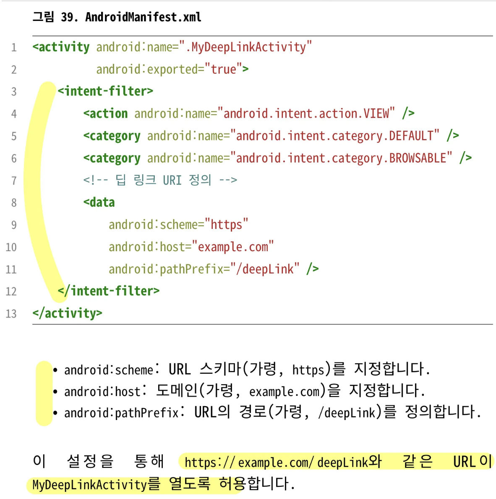

# 11. ContentProvider의 목적은 무엇이며, 애플리케이션 간의 안전한 데이터 공유를 어떻게 용이하게 하나요?

- ContentProvider: 구조화된 데이터에 대한 접근을 관리하고 애플리케이션 간 데이터 공유를 위한 표준화된 인터페이스를 제공하는 컴포넌트. 앱 간의 안전하고 일관된 데이터 공유를 보장함.

## 목적

- 데이터 접근 로직을 캡슐화하여 앱 간 데이터 공유를 더 쉽고 안전하게 만드는 것.
- 기본 데이터 소스를 추상화하고, 데이터와 상호 작용하기 위한 통합 인터페이스 제공

## 주요 구성 요소

- 데이터 접근 주소로 URI사용.

### URI

- 권한(Authority): ContentProvider 식별
- Path: 데이터 유형 지정
- ID(optional): 데이터 셋 내의 특정 항목을 참조

## 구현하기

- ContentProvider를 상속받고 다음 메서드 구현
    - onCreate()
    - query()
    - insert()
    - update()
    - delete()
    - getType()

## 등록하기

- 다른 앱에서 ContentProvider에 접근할 수 있도록 하려면 AndroidManifest.xml에 선언해야 함.

## 데이터 접근하기

- 다른 앱에서 ContentProvider와 상호작용하려면 ContentResolver클래스를 사용해야 함.

## 사용사례

- 다른 애플리케이션 간 데이터 공유
- 앱 시작 시 컴포넌트 또는 리소스 초기화
- 연락처, 미디어 파일 또는 앱별 데이터와 같은 구조화된 데이터에 대한 접근 제공
- 연락처 앱이나 파일 선택기와 같은 안드로이드 시스템 기능과의 통합 활성화
- 세분화된 보안 제어를 통한 데이터 접근 허용

### 리소스나 초기 셋업을 위한 사용 사례

- 일반적으로 리소스나 라이브러리 초기화는 Application 클래스에서 하지만, 관심사를 더 잘 분리하기 위해 초기화 관련 로직을 별도의 ContentProvider에 캡슐화할 수 있음.
- ContentProvider의 onCreate()메서드는 Application.onCreate()보다 먼저 호출, 초기화를 위한 진입점 역할
- Firebase Android SDK는 커스텀 ConetntProvider를 사용하여 의존성을 추가하는 것만으로 자동으로 초기화
    - 필수 리소스나 라이브러리가 앱 프로세스 생명주기 초반에 자동으로 초기화되도록 보장하여 더 깔끔하고 모듈화된 설계를 제공  

&nbsp;
# 12. 구성 변경을 어떻게 처리하나요?

- 구성 변경이 발생할 때 Activity 다시시작, 일시적으로 UI 상태 손실될 수 있음.

## 구성 변경 대응 전략

- UI 상태 저장 및 복원: onSaveInstanceState(), onRestoreInstanceState()
- **Jetpack ViewModel**: 구성 변경에도 유지되어야 하는 UI 관련 데이터 저장
- 구성 변경 수동으로 처리: AndroidManifest.xml에서 android:configChanges속성 선언, onConfigurationChanged() 재정의
- Jetpack Compose에서 rememberSaveable활용

## 추가 팁

- 내비게이션 및 백 스택 보존: Navigation 컴포넌트를 사용하면 구성 변경 시 내비게이션 백 스택 보존됨
- 앱 구성에 의존적인 데이터 피하기: 앱 구성에 의존적인 값을 UI 레이어에 직접 저장하지 않는 것이 좋음.

&nbsp;
# 13. 안드로이드에서 메모리를 어떻게 효율적으로 관리하며, 메모리 누수를 어떻게 방지하는가?

- 가비지 컬렉션 메커니즘을 통해 메모리 관리
- 시스템 메모리가 부족할 때 포그라운드 애플리케이션의 원활한 작동을 우선시, 백그라운드 프로세스를 종료하기 위해 low-memory killer 사용

## 메모리 누수의 원인

- 부적절한 생명주기 관리, 정적 참조, Context에 대한 장기 참조 유지 등..

### 메모리 누수를 피하기 위한 모범 사례

1. 생명주기를 인지하는 컴포넌트 사용
    - ViewModel, CollectAsStateWithLifecycle과 함께 사용하는 Flow, LiveData 등..
2. Context에 대한 오랜 참조 피하기
3. 리스너 및 콜백 등록 올바르게 해제하기
    - onPause() or onStop()에서 BroadcastReceiver 등록 해제
4. 중요하지 않은 객체는 WeakReference 사용
5. 누수 감지 툴 사용(LeakCanary)
6. View에 대한 정적 참조 피하기: View는 Activity 컨텍스트에 대한 참조를 유지하여 메모리 누수를 유발할 수 있음.
7. 리소스 닫기(명시적 해제)
8. Fragment와 Activity 현명하게 사용하기

## 요약

- 생명주기 인식 컴포넌트 사용, Context나 View에 대한 정적 참조 피하기, LeakCanary와 같은 툴 활용

&nbsp;
# 14. ANR이 무엇인지, 주요 원인과 예방법

- ANR = Application Not Responding
- 앱의 메인 스레드가 너무 오랫동안 차단될 때 발생하는 안드로이드의 시스템 오류

## 예방 방법

- 무겁거나 시간이 많이 걸리는 작업을 오프로드하여 메인스레드의 응답성을 유지하는 것이 중요
1. 무거운 작업을 메인 스레드 밖으로 이동
    - Kotlin Coroutines의 [Dispatchers.IO](http://Dispatchers.IO) 활용
2. WorkManager 사용하기
3. 데이터 불러오기 최적화
    - 페이징 구현, 데이터를 작고 관리가능한 청크로 관리
4. 구성 변경 시 UI 작업 최소화: ViewModel 활용
5. Android Studio로 모니터링 및 프로파일링
6. 블로킹 호출 피하기
7. 가벼운 지연 작업에 Handler사용
    - Thread.sleep() 대신 Handler.postDelayed()를 사용, 메인 스레드를 차단하지 않고 가벼운 지연 작업 처리

&nbsp;
# 15. 딥 링크를 어떻게 처리하나?

- 딥링크: 사용자가 URL이나 알림과 같은 외부 소스에서 앱 내의 특정 화면이나 기능으로 직접 이동할 수 있도록 함.
- AndroidManifest.xml에서 이를 정의, 해당 Activity나 Fragment에서 들어오는 Intent를 처리해야 함.

## 1단계: 매니페스트에서 딥 링크 정의하기

- 딥 링크를 처리해야 하는 Activity에 대해 AndroidManifest.xml에서 intent filter 선언

    

## 2단계: Activity에서 딥 링크 처리하기

- Activity 내부에서 들어오는 Intent 데이터를 검색하고 처리하여 적절한 화면으로 이동하거나 작업을 수행

## 3단계: 딥 링크 테스트하기

## 추가 고려 사항

- 커스텀 스키마: 앱 내부적으로 실행하는 딥 링크에 대해서는 커스텀 스키마를 사용할 수 있지만, 경우에 따라 더 넓은 호환성을 위해 HTTP(s) URL을 선호
- 내비게이션: 앱 내의 다른 Activity나 Fragment로 이동하기 위해 Intent 사용
- 폴백처리(fallback): 딥 링크 데이터가 유효하지 않거나 불완전한 경우를 처리하여 더 나은 사용자 경험 제공
- App Links: HTTP(s) 딥 링크가 브라우저 대신 앱에서 직접 열리도록 하려면 App Links 설정해야 함.

&nbsp;
# 16. 태스크와 백 스택이란 무엇인가?

- 태스크: 사용자가 특정 목표를 달성하기 위해 상호작용하는 Activity의 집합
- 태스크는 백스택으로 구성, 후입선출 구조

## 태스크(Tasks)

- 일반적으로 런처나 Intent를 통해 Activity가 실행될 때 시작됨.
- 태스크는 연관된 Activity가 소멸될 때까지 활성 상태를 유지

## 백 스택(Back Stack)

- 태스크 내 Activity의 기록을 유지

- 태스크와 백 스택은 **Activity 런치모드**와 **인텐트 플래그(intent flags)**의 영향을 받음.
- Activity가 어떻게 시작되고 다른 Activity와 어떻게 상호작용하는지 정의.

## 런치 모드(Launch Modes)

- Activity가 어떻게 인스턴스화되고 백스택에서 처리되는지 결정
1. standard: 기본 런치모드. 인스턴스가 이미 존재하더라도 Activity가 시작될 때마다 새 인스턴스가 생성되어 백 스택에 추가
2. singleTop: 이미 백 스택의 맨 위에 있는 경우 새 인스턴스가 생성되지 않음.
3. singleTask: 태스크 내에 Activity의 인스턴스가 하나만 존재. 인스턴스가 이미 존재하는 경우 맨 앞으로 가져오고 onNewIntent()가 호출. 앱의 진입점 역할을 하는 Activity에 유용
4. singleInstance: singleTask와 유사하지만, Activity가 다른 Activity와 분리된 고유한 태스크에 배치. 동일한 태스크에 다른 Activity가 포함될 수 없도록 보장

## 인텐트 플래그(Intent Flags)

- Intent가 전송될 때 Activity가 시작되는 방식이나 백스택의 동작을 수정하는데 사용
- `FLAG_ACTIVITY_NEW_TASK`: 새 태스크에서 Activity를 시작하거나, 태
스크가 이미 존재하는 경우 해당 태스크를 맨 앞으로 가져옵니다.
- `FLAG_ACTIVITY_CLEAR_TOP`: Activity가 이미 백 스택에 있는 경우, 그
위에 있는 모든 Activity가 날아가고 기존 인스턴스가 Intent를
처리합니다.
- `FLAG_ACTIVITY_SINGLE_TOP`: Activity가 백 스택의 맨 위에 있는 경우
새 인스턴스가 생성되지 않도록 보장합니다. 이는 종종 다른 플
래그와 함께 사용됩니다.
- `FLAG_ACTIVITY_NO_HISTORY`: Activity가 백 스택에 추가되는 것을 방
지하여 종료 후에도 유지되지 않도록 합니다.

## 사용 사례

- 런치 모드는 주로 AndroidManifest.xml 파일의 <activity> 태그 아래에 선언, 개발자가 Activity의 기본 동작 설정
- 인텐트 플래그는 Intent를 생성할 때 개발자가 유동적으로 플래그를 설정할 수 있는 방식으로 작동
- 런치모드는 Activity가 태스크 내에서 어떻게 시작되고 관리되는지에 대한 기본 동작을 정의하는 반면, 인텐트플래그는 유사한 동작에 대해 런타임에 제어

&nbsp;
# 17. Bundle의 사용 목적

- Bundle
    - (Activity, Fragment, Service..)컴포넌트 간에 데이터를 전달하는 데 사용되는 키-값 쌍 데이터 구조
    - 앱 내에서 작은 용량의 데이터를 효율적으로 전송하는데 사용
    - 컴포넌트 및 생명주기 이벤트 간에 데이터를 효율적으로 전달하고 보존하기 위한 안드로이드의 중요한 구성 요소

## 일반적인 사용사례

1. Activity간 데이터 전달
2. Fragment간 데이터 전달
3. 인스턴스 상태 저장 및 복원: onSaveInstanceState(), onRestoreInstanceState()
4. Service에 데이터 전달<

&nbsp;
# 18. Activity or Fragment 간에 데이터를 어떻게 전달하나요?

## Activity 간 데이터 전달

- 가장 일반적인 메커니즘은 Intent
- 데이터는 키-값 쌍의 형태로 인텐트에 추가, 수신하는 액티비티는 getIntent()를 사용하여 값 가져옴.

## Fragment 간 데이터 전달

- Bundle 사용 가능
- 키-값 쌍의 형태로 Bundle을 생성하고, arguments를 통해 수신하는 Fragment로 전달

## Jetpack Navigation 라이브러리로 Fragment 간 데이터 전달하기

- Safe Args 플러그인 사용
1. 내비게이션 그래프에서 인수 정의하기
2. 소스 프래그먼트에서 데이터 전달하기
3. 대상 프래그먼트에서 데이터 검색하기

## Shared ViewModel 사용하기

- 동일한 액티비티 내에서 Fragment끼리 통신해야 하는 경우 Shared ViewModel 고려
- Shared ViewModel: 동일한 액티비티 내의 여러 Fragment간에 공유되는 ViewModel 인스턴스
- ViewModel의 범위를 액티비티로 지정하여 프래그먼트가 동일한 ViewModel 인스턴스에 접근하고 공유할 수 있도록 함.
- Fragment끼리 의존성이 생기는 것을 피하고, 반응형으로 상호작용할 때 각 Fragment의 생명주기에 따라 안전하게 데이터 수신 가능

&nbsp;
# 19. 화면 회전과 같은 구성 변경이 발생하면 Activity에 어떤 변화가 생기나요?

- 현재 Activity를 종료하고 다시 실행
- 앱의 리소스가 변경된 구성을 새롭게 반영하고 앱이 다시 로드되도록 보장

## 구성 변경 중 기본 동작

### 1. Activity 종료 및 재시작

- 현재 실행중인 액티비티의 onPause(), onStop(), onDestroy() 메서드 순차적 호출
- 액티비티 다시 시작, onCreate() 메서드 호출

### 2. 리소스 다시 로드하기

### 3. 데이터 손실 방지

## 재생성을 유발하는 구성 변경

### 1. 화면 회전

### 2. 다크/라이트 테마 변경

### 3. 글꼴 크기 변경

### 4. 언어 변경

## Activity 재생성 피하기

- AndroidManifest.xml에서 android:configChanges 속성 추가
    - 변경 사항을 개발자가 수동적으로 처리하는 형태로 책임을 개발자에게 위힘

&nbsp;
# 20. ActivityManager란 무엇인가요?

- 기기에서 실행 중인 액티비티, 태스크, 프로세스에 대한 정보를 제공하고 관리하는 안드로이드 시스템 서비스
- 개발자가 앱 생명주기, 메모리 사용량 및 태스크 관리 측면과 상호작용하고 제어할 수 있도록 함.
- 시스템 수준 관리, 성능 튜닝, 앱 동작 모니터링을 위함.
- 최신 안드로이드에서는 해당 기능들이 부분적으로 더 고도화된 API로 대체되었지만, 여전히 활용 가능

## 주요 기능

1. 태스크 및 Activity 정보
2. 메모리 관리
3. 앱 프로세스 관리
4. 디버깅 및 진단

## 제공 메서드

- getRunningAppProcesses(): 기기에서 현재 실행 중인 프로세스 목록 반환
- getMemoryInfo(ActivityManager.MemoryInfo): 시스템에 대한 자세한 메모리 정보 검색
- killBackgroundProcesses(String): 지정된 앱의 백그라운드 프로세스 종료
- isLowRamDevice(): 기기가 저사양 RAM으로 분류되는지 확인. 저메모리 기기에 대한 리소스 사용량 최적화 시 도움
- appNotResponding(String): 테스트 목적으로 ANR 이벤트 시뮬레이션
- clearApplicationUserData(): 애플리케이션과 관련된 모든 사용자별 데이터 지움. 공장 초기화나 앱을 기본 상태로 재설정하는 경우 종종 사용

## LeakCanary에서의 ActivityManager활용

- LeakCanary에서 내부적으로 메모리 상태 및 정보 추적을 위해 ActivityManager 활용