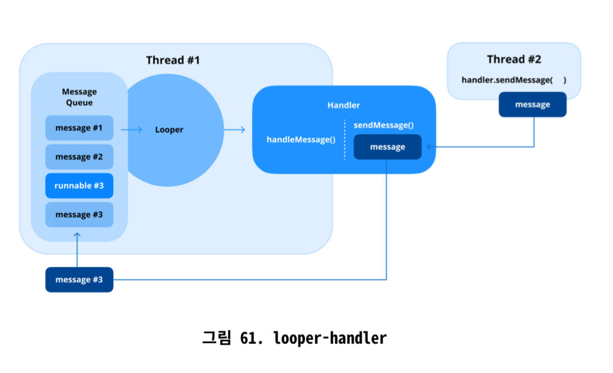

# 21. SparseArray를 사용하면 어떤 이점이 있나요?

- SparseArray: HashMap과 유사하게 정수 키를 객체 값에 매핑하는 안드로이드에 최적화된 데이터 구조
- 정수 기반 키를 사용할 때 메모리 관리 측면에서 효율이 좋고 상황에 따라 성느이 더 좋음.

## 주요 특징

1. 메모리 효율성: 오토박싱X, Entry 객체와 같은 추가 데이터 구조에 의존하지 않음 → HashMap보다 훨씬 적은 메모리 소비
2. 성능: 중간 크기의 데이터 셋에서 더 나은 성능 제공
3. Null 키 값 사용 불가: 키 값에 null 사용 허용 x

## 이점

1. 오토박싱 방지: int를 Integer로 바꾸지 않고 직접 작동하여 메모리와 계산 작업 절약
2. 메모리 절약: 내부적으로 기본 배열 사용
3. 컴팩트한 데이터 저장에 효율적: 밀도가 낮은 데이터 셋이나 키가 넓은 정수 범위에 걸쳐 드문드문 분포된 데이터 셋에 적합
4. 안드로이드 특화

## 한계

1. 성능 트레이드오프: 이진 탐색을 사용하기 때문에 매우 큰 데이터셋의 경우 HashMap보다 느림
2. 정수 키만 사용가능

## 요약

- SparseArray는 안드로이드에서 메모리 효율성을 위해 최적화된, 정수키를 객체 값에 매핑하는 특수한 자료구조로 안드로이드 애플리케이션과 같이 리소스가 제한적인 사례에 유용

# 22. 런타임 권한을 어떻게 처리하나요?

- 안드로이드 6.0부터 앱 설치 시 런타임에 위험 권한을 명시적으로 요청해야 함. 필요할 때만 권한을 부여하도록 허용하여 사용자 개인 정보 보호 강화

## 권한 선언 및 확인

- 권한 요청 전에 AndroidManifest.xml 파일에 해당 권한 선언
- 런타임 시에는 사용자가 해당 권한이 필요한 기능과 상호 작용할 때만 권한 요청
- **`ContextCompat.checkSelfPermission()`을 사용하여 권한이 이미 부여되었는지 확인하는 것이 중요**

## 권한 요청하기

- 권장되는 방법은 권한 처리를 단순화하는 **ActivityResultLauncher API**를 사용하는 것

## 권한 요청 근거(Rationale) 제공하기

- 경우에 따라 shouldShowRequestPermissionRationale()을 사용하여 해당 기능을 사용하기 위해 권한이 필요한 근거를 표시할 것을 권장

```kotlin
fun showPermissionRationale() {
	AlertDialog.Builder(this)
		.setTitle("권한 필요")
		.setMessage("이 기능이 제대로 작동하기 위해 카메라 접근 권한이 필요합니다.")
		.setPositiveButton("확인") {_, _ ->
			requestPermissionLauncher.launch(Manifest.permission.CAMERA)
		}
		.setNegativeButton("취소", null)
		.show()
}
```

## 권한 거부 처리

- 사용자가 권한을 여러 번 거부하면 안드로이드는 이를 영구 거부로 처리. 다시 요청 불가
- 사용자에게 기능 제한에 대해 알리고 필요한 경우 시스템 설정으로 안내

## 위치 권한 처리

- 포그라운드, 백그라운드 접근으로 분류.
- 백그라운드 접근은 추가적으로 ACCESS_BACKGROUND_LOCATION 권한 필요
- 포그라운드 접근 권한을 요청한 다음 별도로 백그라운드 권한 요청해야 함.

## 일회성 권한

- 안드로이드 11(API 레벨 30)은 위치, 카메라, 마이크에 대해 일회성 권한 도입
- 임시적으로 접근 권한 부여, 앱 종료하면 해당 권한 사라짐

# 23. Looper, Handler, HandleThread의 역할

- Loop, Handler, HandlerThread는 스레드를 관리하고 비동기 통신을 처리하기 위해 함께 작동하는 컴포넌트.
- 백그라운드 스레드에서 작업을 수행하면서 UI 업데이트를 위해 메인스레드와 상호작용하기 위한 필수 컴포넌트



## Looper

- 메시지 또는 작업 큐를 순차적으로 처리하는 안드로이드 스레딩 모델의 일부
- 목적: 메시지 큐를 지속적으로 모니터링하고 메시지나 작업을 적절한 핸들러에 가져와 디스패치
- 사용법: 메시지를 처리하는 모든 스레드에는 looper 필요. 메인스레드에는 자동으로 looper가 있지만, 워커 스레드의 경우 명시적으로 준비해야 함.
- 초기화: Looper.prepare()를 사용하여 스레드에 looper연결, Looper.loop()를 사용하여 루프 시작

## Handler

- 스레드의 메시지 큐 내에서 메시지나 작업을 보내고 처리하는데 사용
- 목적: 한 스레드에서 다른 스레드로 작업이나 메시지 전달
- 동작: Handler가 생성될 때, 생성된 스레드 및 해당 스레드의 Looper에 연결. Handler로 전송된 작업은 해당 스레드에서 처리됨.

## HandlerThread

- 내장된 Looper를 가진 특수한 Thread
- 작업 또는 메시지 큐를 처리할 수 있는 백그라운드 스레드를 생성하는 과정을 단순화
- 목적: 자체 Looper를 사진 워커 스레드 생성
- 생명주기: start()로 HandlerThread 시작, getLooper()를 사용하여 Looper 얻음. quit() 또는 quitSafely()를 사용하여 Looper 종료, 리소스해제.

## 주요 차이점 및 관계

1. Looper: 메시지 처리의 중추. 스레드를 살아있게 유지하고 메시지 큐 처리
2. Handler: Looper와 상호작용하여 메시지와 작업을 큐에 넣거나 처리
3. HandlerThread: 자동 Loop 설정으로 백그라운드 스레드 설정 단순화

## 사용 사례

1. Looper: 연속적인 메시지 큐 관리하는데 사용
2. Handler: 스레드간 통신(가령, 백그라운드 스레드에서 UI 업데이트)에 이상적
3. HandlerThread: 전용 스레드가 필요한 백그라운드 작업에 적합(데이터 처리 or 네트워크 요청)

# 24. 예외를 어떻게 추적하나요?

## logcat을 이용한 예외 로깅

## try-catch를 이용한 예외 처리

## 전역 예외 핸들러 사용하기

- Thread.setDefaultUncaughtExceptionHandler를 사용하여 전역 예외 핸들러 설정
- 중앙 집중식 오류 보고 또는 로깅에 유용
- 애플리케이션 전체의 런타임 문제를 디버깅하고 모니터링하는데 매우 효과적

## Firebase Crashlytics 사용하기

- 프로덕션 환경에서 예외 추적하기 좋음
- 처리되지 않은 예외를 자동으로 기록하고 스택 트레이스, 기기 상태 및 사용자 정보와 함께 자세한 크래시 보고서 제공

## 브레이크 포인트를 이용한 디버깅

## 버그 리포트 캡처

- 기기 로그, 스택 트레이스 및 시스템 정보를 수집하여 문제를 진단하고 수정하는 데 도움

# 25. 빌드 변형(build variants)과 플레이버(flavors)란?

- build variants와 flavors는 단일 코드베이스에서 애플리케이션의 다양한 버전을 생성하는 유연한 방법 제공.
- 개발 및 프로덕션 빌드, 무료 및 유료 버전과 같은 여러 구성을 효율적으로 관리

## build variants

- 빌드 타입과 제품 플레이버를 결합한 결과
- 다양한 사용 사례에 맞는 APK 또는 번들을 생성할 수 있도록 함.

### build type

- Debug: 개발 중에 사용
- release: 배포에 최적화된 구성. 리소스 최적화 및 최소화, 난독화가 적용되고 스토어 게시를 위해 별로의 릴리스 키로 서명해야 함.

### product flavors

- 무료 및 유료 버전이나 us, eu와 같은 지역별 버전과 같이 앱의 다양한 변형 정의 가능

## 빌드 변형 및 플레이버 사용의 이점

1. 효율적인 구성: 단일 코드베이스에서 여러 빌드 처리
2. 커스텀 동작
3. 자동화: 빌드 변형에 따라 APK 서명, 최적화 및 난독화와 같은 작업 자동화

# 26. 접근성을 어떻게 보장하나요?

- WCAG(Web Content Accessibility Guidelines)

## 콘텐츠 설명 활용하기

- UI 컴포넌트에 텍스트 레이블 제공, TalkBack과 같은 스크린 리더가 시각 장애가 있는 사용자에게 해당 컴포넌트를 알릴 수 있도록 함.
- android:contentDescription 속성 사용

## 동적 글꼴 크기 지원

- 사용자가 설정한 글꼴 크기 환경 설정 존중하도록 보장(sp 단위 사용)

## 포커스 관리 및 탐색

- 커스텀 뷰, 다이얼로그 및 양식의 경우 포커스 동작을 적절히 관리
- android:nextFocusDown, android:nextFocusUp 및 관련 속성 사용

## 색상 대비 및 시작적 접근성

- 텍스트와 배경색 간에 충분한 대비 제공
- Android Studio의 Accessibility Scanner같은 도구 활용

## 커스텀 뷰 및 접근성

- 커스텀 뷰 만들 때 AccessibilityDelegate구현, 스크린 리더가 커스텀 UI 컴포넌트와 상호 작용하는 방식 정의

## 접근성 테스트

- Android Studio의 Accessibility Scanner 및 Layout Inspector와 같은 도구 사용

# 안드로이드 파일 시스템이란?

- 안드로이드 기기에서 데이터 저장을 관리하고 구성하는 구조화된 환경
- 리눅스의 파일 시스템 아키텍처 위에 구축

## 주요 구성요소

- System Partition(/system): 핵심 운영 체제 파일. 읽기전용
- Data Partition(/data): 데이터베이스, SharedPreferences 및 사용자가 생성한 파일을 포함한 앱별 데이터 저장. /data/data 내에 해당 앱만 접근할 수 있는 비공개 디렉토리 가짐.
- Cache Partition(/cache): 임시 데이터 저장
- External Storage(/sdcard or /storage): 여러 앱에서 접근할 수 있는 공유 저장 공간 제공. 이미지, 비디오, 문서와 같은 미디어 파일에 자주 사용
- Temporary Files(/tmp): 임시 파일

## 안드로이드에서 파일 접근하기

- 안드로이드 프레임워크에서 제공하는 API를 사용하여 파일 시스템과 상호 작용
- 내부 저장소: 애플리케이션 샌드박스 내의 비공개 저장공간, 해당 앱만 접근 가능.
- 외부 저장소: 여러 앱에서 접근할 수 있는 공유 저장 공간

## 파일 권한 및 보안

- 비공개 앱 데이터: 해당 앱만 접근 가능
- 공유 파일: 앱 간에 파일을 공유하려면 외부 저장소나 적절한 권한이 있는 ContentProvider 사용
- 범위 지정 저장소: 공유 저장소에 대한 직접 접근 제한, 앱이 MediaStore 또는 SAF(Storage Access Framework) API를 사용하도록 요구

# 28. 안드로이드 런타임(ART), Dalvik, Dex 컴파일러란?

## ART

- 안드로이드 앱 실행을 위한 런타임으로 Dalvik을 대체하며 여러 사항들 개선
- Ahead-Of-Time(AOT) 컴파일을 사용, 앱 설치 중에 바이트코드를 기계 코드로 변환
    - Just-In-Time(JIT) 컴파일의 필요성을 없애 앱 시작 시간을 단축하고 실행 중 CPU 사용량 줄임
- **개선된 성능**: 런타임 오버헤드 감소
- **가비지 컬렉션**: 개선된 가비지 컬렉션 기술 도입
- **디버깅 및 프로파일링 지원**: 개발자를 위해 상세한 스택 트레이스 및 메모리 사용량 분석과 같은 향상된 도구 제공

## Dalvik

- ART 이전에 안드로이드에서 사용된 런타임. 가상 머신 환경에서 애플리케이션을 실행하도록 설계
- JIT 컴파일을 사용하여 런타임에 바이트 코드를 기계 코드로 변환. 즉석 컴파일로 인해 런타임 오버헤드 증가
- **컴팩트한 바이트 코드**: 최적화된 .dex 파일 사용
- **레지스터 기반 VM**: 스택 기반이 아닌 레지스터 기반으로 명령어 효율성 향상
- 느린 앱 시작 시간과 높은 CPU 사용량과 같은 한계로 ART로 대체

## Dex 컴파일러

- Java 바이트코드를 .dex파일로 변환.
- .dex 파일은 컴팩트하며 Dalvik 및 ART 런타임 환경에 최적화
- 멀티덱스 지원: 바이트 코드를 여러 .dex 파일로 분할 지원
- 바이트코드 최적화

## Dalvik에서 ART로의 전환

- ART는 안드로이드 런타임 환경을 상당히 개선
- Dalvik용으로 설계된 앱은 .dex 파일을 사용하기 때문에 ART와 완벽하게 호환, 개발자에게 원활한 마이그레이션 보장

# 29. APK 파일과 AAB 파일의 차이점은 무엇인가요?

## APK(Android Package)

- 안드로이드 애플리케이션을 배포하고 설치하는 전통적인 포맷
- 앱이 기기에서 작동하는데 필요한 모든 리소스, 코드 및 메타데이터를 포함하는 완전하고 즉시 설치 가능한 패키지
- 사용자의 기기와 관련 없는 리소스를 포함하게 되어 파일 크기가 커질 수 있음.
- 공식 앱 스토어 외부에서 공유하거나 사이드로딩 가능

## AAB(Android App Bundle)

- APK와 같은 설치 가능한 형식이 아닌 게시 포맷
- 개발자는 AAB를 Google Play에 업로드하면, Google Play는 이를 개별 기기에 맞게 최적화된 APK로 처리
- 모듈식, 다른 구성에 대한 리소스와 코드를 별개의 번들로 분리
- Google Play의 서버측에서 처리되므로 직접 설치할 수 없음

## 주요 차이점

|  | APK | AAB |
| --- | --- | --- |
| 목적 및 구조 | 모든 구성에 대한 모든 리소스와 코드를 포함하는 완전한 패키지 | 기기별 APK를 생성하는 모듈식 게시 형식 |
| 파일 크기 | 더 큼 | 더 작고 최적화된 APK 생성 |
| 배포 | 기기에 직접 공유, 사이드로딩 가능 | Google Play에 업로드, 최적화된 APK 생성 |
| 관리 | 개발자가 리소스와 구성을 수동으로 관리 | 구성 관리를 Google Play에 위임. 프로세스 자동화 |
| 도구 및 호환성 | 모든 안드로이드 기기 및 앱스토어에서 지원 | Google Play 또는 bundletool 필요. Google 외 앱 스토어와 호환 X |

# 30. R8 최적화란?

- 안드로이드 빌드 프로세스에서 APK 또는 AAB의 크기를 줄이고 런타임 성능을 향상시키기 위해 사용되는 코드 축소 및 최적화 도구.
- 이전의 프로가드(Proguard) 도구 대체

## 작동 방식

- 빌드 단계 중에 애플리케이션 코드 수정, 아래의 목적들 달성
    - 코드 축소
    - 최적화
    - 난독화
    - 리소스 최적화

## 주요 특징

- 죽은 코드 제거
- 인라이닝: 짧은 메서드나 함수 직접 인라인
- 클래스 병합
- 도달 불가능한 코드 제거
- 상수 폴딩 및 전파
- 난독화

## 구성

- Proguard 규칙 동일하게 사용
- 코드의 어떤 부분을 축소, 난독화, 최적화에서 제외할지 지정 가능
    - 리플렉션을 위한 코드 보존
    - 서드파티 라이브러리 제외

## 장점

- 긴밀한 통합: 안드로이드 빌드 시스템에 내장, 일반적인 Proguard 규칙 외에 추가 설정 필요 X
- 향상된 효율성: Proguard보다 빠르고 효율적
- 앱 크기 감소
- 향상된 보안

## 한계

- 과도한 축소 위험: R8이 간접적으로 참조되는 코드나 리소스를 제거하여 런타임 오류 유발 가능
- 복잡한 구성: 복잡한 프로젝트의 경우 Proguard 규칙 작성이 복잡하고 까다로울 수 있음
- 디버깅 어려움