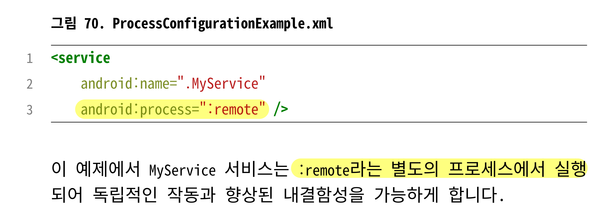
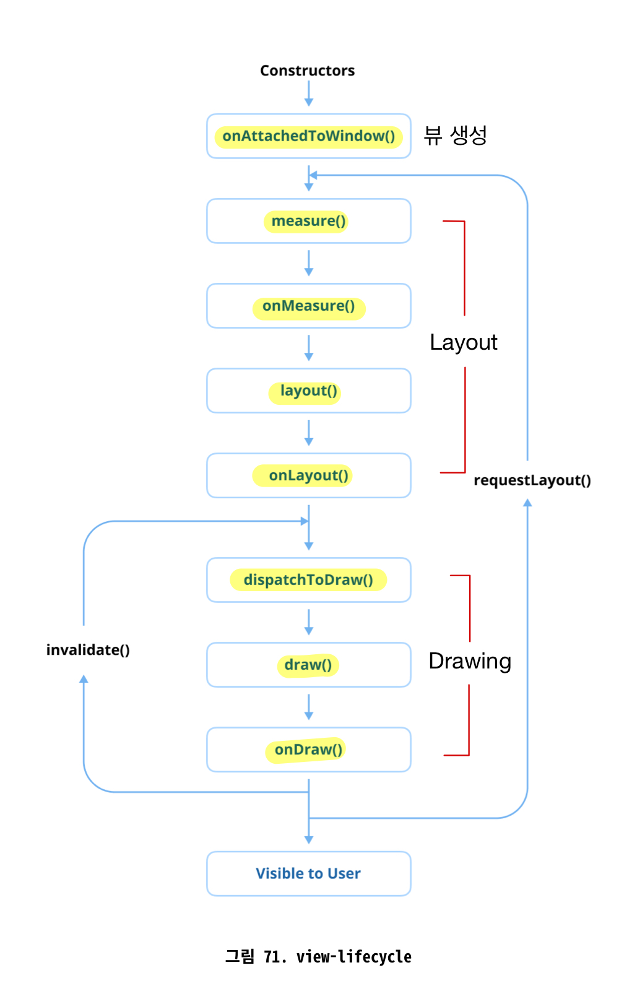

# 31. 애플리케이션 용량을 어떻게 줄이나요?

## 사용하지 않는 리소스 제거하기

- Lint 불필요한 리소스 식별하는데 도움
- Build.gradle 파일에서 shrinkResource를 활성화하여 빌드 프로세스 중에 사용되지 않는 리소스 자동으로 제거

```xml
android {
	buildTypes {
		release {
			minifyEnables true
			shrinkResources true
		}
	}
}
```

## R8로 코드 축소 활성화

- ProGuard를 적절히 사용하면 중요한 코드나 리플렉션 기반 라이브러리는 난독화를 생략하고 오동작하지 않도록 보장

## 리소스 최적화 사용

- 이미지 및 XML 파일과 같은 리소스 최적화
- 벡터 드로어블(Vector Drawables)
- 이미지 압축: TinyPNG 또는 ImageMagick과 같은 도구 사용
- WebP 형식: 압축률이 좋은 WebP형식으로 변환

## Android App Bundles(AAB) 사용하기

- Google Play가 개별 기기에 맞는 최적화된 APK 제공

## 불필요한 의존성 제거

- Android Studio의 Gradle Dependency Analyzer사용하여 무거운 라이브러리 및 전이 의존성 식별 가능

## 네이티브 라이브러리 최적화

- 사용하지 않는 아키텍처 제외: build.gradle 파일의 abiFilters 옵션을 사용하여 필요한 ABI만 포함
- 디버그 심볼 제거

## Proguard 규칙을 구성하여 디버그 정보 줄이기

- 디버깅 메타데이터는 최종 APK 또는 AAB에 불필요한 무게를 더함

```
-dontwarn com.example.unusedlibrary.**
-keep class com.example.important.** { *; }
```

## 동적 기능(Dynamic Features) 사용하기

- 자주 사용되지 않는 기능을 주문형 모듈(해당 기능이 필요한 경우 설치)로 분리

## 앱 내 대용량 에셋 피하기

- 대용량 에셋은 컨텐츠 전송 네트워크(CDN)에 호스팅하고 런타임에 동적으로 로드
- 미디어 컨텐츠는 앱과 함께 번들링하는 대신 스트리밍 사용

# 32. 안드로이드 애플리케이션의 프로세스(process)란 무엇이며, 안드로이드 OS는 이를 어떻게 관리하나요?

- 안드로이드에서 프로세스는 애플리케이션이 실행되는 환경을 의미
- 각 안드로이드 앱은 다른 앱과 격리된 자체 프로세스에서 단일 실행 스레드로 작동. 시스템 보안, 메모리 관리 및 내결함성 보장
- 기본적으로 동일한 애플리케이션의 모든 컴포넌트는 메인 스레드라고 하는 동일한 프로세스 및 스레드에서 실행

## 안드로이드에서 프로세스 작동 방식

- 애플리케이션이 시작되면 운영 체제는 리눅스 fork() 시스템 함수 호출, 해당 앱을 위한 새 프로세스 생성
- 각 프로세스는 Dalvik or ART 가상 머신의 고유 인스턴스에서 실행되어 안전하고 독립적인 실행 보장

## 애플리케이션 컴포넌트와 프로세스 연결

- AndroidManifest.xml 파일의 android:process 속성을 사용하여 프로세스 할당 커스텀 가능
- <activity>, <service>, <erceiver>, <provider>와 같은 컴포넌트가 별도의 프로세스에서 실행되거나 선택적으로 프로세스를 공유할 수 있도록 함.



- 다른 애플리케이션의 컴포넌트가 동일한 리눅스 사용자 ID를 사지고 동일한 인증서로 서명된 경우 동일한 프로세스 공유 가능
- 안드로이드는 시스템 리소스 요구에 따라 프로세스를 동적으로 관리하며, 필요할 때 우선순위가 낮은 프로세스 종료

## 프로세스와 앱 생명주기

1. 포그라운드 프로세스: 가장 높은 우선순위
2. 보이는 프로세스: 보이지만 활발하게 상호 작용하지 않는 프로세스
3. 서비스 프로세스: 백그라운드 Service를 실행하는 프로세스
4. 캐시된 프로세스: 우선순위 가장 낮음

## 보안 및 권한

- 각 안드로이드 프로세스는 리눅스 보안 모델을 사용하여 샌드박스 처리. 엄격한 권한 기반 접근 제어 시행

# Activities, Services, Broadcast Receivers, Content Providers가 안드로이드의 4대 주요 컴포넌트라고 불리는 이유는?

- 안드로이드 애플리케이션이 시스템 및 다른 애플리케이션과 상호 작용할 수 있도록 하는 필수 구성 요소
- 앱의 생명주기를 관리하고, 동작을 정의하며, 프로세스 간 통신을 가능하게 함
- **프로세스와 밀접한 관련이 있음.**

### Activities

- 사용자 인터페이스가 있는 단일 화면
- 사용자 상호작용의 진입점이며 안드로이드 프로세스 생명주기와 밀접하게 연결

### Services

- 백그라운드 작업 수행
- 앱의 매니페스트에 지정된 android:process 속성에 따라 앱과 동일한 프로세스 또는 별도의 프로세스에서 실행

### Broadcast Receivers

- 네트워크 변경이나 배터리 상태 업데이트와 같은 시스템 전체 브로드캐스트 메시지를 수신하고 응답할 수 있음.
- 앱이 실행중이 아니더라도 트리거되어 필요한 경우 안드로이드 시스템이 해당 프로세스를 시작하도록 함.

### Content Providers

- 공유 애플리케이션 데이터 관리, 앱이 중앙 집중식 데이터베이스에서 읽거나 쓸 수 있도록 함
- 프로세스 간 통신 허용

## 안드로이드 프로세스와의 연결

- 각 컴포넌트는 매니페스트 파일의 android:process 속성을 사용하여 자체 프로세스를 할당받을 수도 있어 리소스 집약적인 작업에 더 많은 유연성 제공
- 4 컴포넌트 각각이 안드로이드 OS에서 자체 전용 프로세스를 가질 수 있음.
- 다른 안드로이드 컴포넌트에 비해 더 강력하고 독립적
- 백그라운드 실행, IPC, 시스템 수준 상호작용을 가능하게 함.
- 안드로이드 앱이 복잡한 다중 프로세스 작업을 효율적으로 처리할 수 있도록 보장

# 뷰

# 33. View 생명주기를 설명해주세요

- View 생명주기(Lifecycle)는 View가 생성되고, Activity나 Fragment에 연결되고, 화면에 표시되고, 최종적으로 소멸되거나 분리되는 동안 거치는 생명주기 이벤트를 나타냄
- 왜 알아야하는가? → 개발자가 View의 초기화, 랜더링 및 소멸을 관리하고, 사용자 작업 또는 시스템 이벤트에 응답하여 View 생명주기에 따라 커스텀 뷰 구현하며, 적절한 시점에 리소스를 폐기하는데 도움



### 뷰 생성

- View가 하드 코딩 방식으로 인스턴스화되거나 XML 레이아웃에서 인플레이션되는 단계
- 리스너 설정 및 데이터 바인딩과 같은 초기 설정 작업이 여기서 수행
- onAttachedToWindow()는 View가 부모 뷰에 추가되고 화면 렌더링을 할 준비를 마쳤을 때 트리거

### Layout 단계(onMeasure, onLayout)

- View의 크기와 위치 측정
- onMeasure(): View의 높이와 너비 결정
- onLayout(): 화면에 표시될 위치 최종 결정

### Drawing 단계(onDraw)

- View의 내용을 Canvas에 렌더링
- 커스텀 View는 해당 메서드를 재정의하여 커스텀드로잉 로직 구현

### Event 처리(onTouchEvent, onClick)

- 사용자 상호 작용 처리

### View 분리(onDetachedFromWindow)

- View가 화면과 부모 ViewGroup에서 제거될 때 호출
- 리소스를 정리하거나 리스너 분리하는 데 이상적

### View 소멸

- 가비지 컬렉션
- 이벤트 리스너나 백그라운드 작업과 같은 모든 리소스가 적절하게 해제되었는지 확인

# findViewTreeLifecycleOwner()

- View클래스의 확장 함수
- View 트리에 연결된 가장 가까운 LifecycleOwner를 찾아 반환
    - 찾지 못하면 null 반환
- 생명주기 인식 컴포넌트 작업을 단순화하여 적절한 생명주기 관리를 보장하고, View와 호스팅 컴포넌트 간의 결합도 줄임

## 사용하는 이유

- LiveData, ViewModel 또는 lifeCycleObserver와 같은 생명주기 인식 요소와 상호작용해야 하는 커스텀 View나 서드파티 컴포넌트로 작업할 때 특히 유용
- 호스팅 Activity나 Fragment에 대한 명시적인 의존성 없이 연관된 생명주기에 접근 가능

### 보장

- 생명주기를 인식하는 컴포넌트(LiveData 등)가 올바른 생명주기에 제대로 바인딩
- 생명주기가 끝나면 관찰자가 정리되도록 하여 메모리 누수 방지

## 주요 사용 사례

- 커스텀 뷰
- 서드파티 라이브러리
- 로직 결합도 분리: 부모 클래스와의 결합도 줄이는데 도움

## 한계

- LifecycleOwner를 제공하는 소유자가 없으면 null반환. 크래시나 예상치 않은 동작이 발생할 수 있기 때문에 신중하게 사용

# 34. View와 ViewGroup의 차이점

- UI 계층 구조에서 다른 목적
- View는 모든 UI 요소의 근간, ViewGroup은 여러 View 객체를 구성하고 관리하기 위한 컨테이너 역할

## View

- 화면에 표시되는 직사각형 형태의 UI를 구현하는 최소 단위의 단일 컴포넌트
- 모든 UI 컴포넌트의 기본 클래스
- 각 뷰는 화면에 렌더링되면 터치 또는 키 이벤트와 같이 애플리케이션 사용자와의 상호작용 처리

<aside>
💡

- 기본 버튼부터 복잡한 레이아웃까지 모든 UI 요소는 View 클래스 위에 구축
- View 인스턴스를 생성하고 관리하는 것 상당한 오버헤드 수반
- 불필요한 View 생성은 애플리케이션 성능에 영향을 미침
- 가능한 한 불필요한 View 인스턴스 피하기
- 레이아웃 트리의 계층 구조를 단순화하는 것 중요
</aside>

## ViewGroup

- 여러 View 또는 다른 ViewGroup 요소를 포함하는 일종의 컨테이너
- LinearLayout, RelativeLayout, ConstraintLayout, FrameLayout과 같은 레이아웃의 기본이 되는 클래스
- 자식 뷰의 레이아웃과 위치 관리, 자식 뷰들의 사이즈가 측정되고 그려지는 방식 정릐\

<aside>
💡

- View를 확장하고 ViewParent 및 ViewManager 인터페이스 모두 구현
- 독립형 View보다 본질적으로 더 복잡하고 리소스 집약적
- ViewGroup인스턴스의 과도한 중첩은 렌더링 성능에 부정적인 영향 미침
- **ViewParent**: View객체의 부모 역할, 레이아웃 측정, 터치 이벤트 처리 및 렌더링 순서 관리
- **ViewManager**: ViewGroup 계층 내에서 자식 뷰를 동적으로 추가하고 제거하는 메서드 제공
- 불필요한 중첩을 줄이는 것이 성능을 최적화하고 원활한 UI 렌더링 보장
</aside>

## 주요 차이점

### 목적

- View는 콘텐츠를 표시하거나 사용자와 상호작용하도록 설계된 단일 UI 요소
- ViewGroup은 여러 자식 뷰를 구성하고 관리하기 위한 컨테이너

### 계층

- View: UI 계층 구조의 리프 노드
- ViewGroup: 여러 자식 뷰 또는 다른 ViewGroup 요소를 포함할 수 있는 브랜치 노드

### 레이아웃 동작

- View: 레이아웃 매개변수에 의해 정의된 자체적인 크기와 위치 가짐
- ViewGroup: LinearLayout, ConstraintLayout과 같이 정의된 레이아웃 규칙을 사용하여 자식 뷰의 위치와 크기 결정

### 상호작용 핸들링

- View: 터치 및 키 이벤트 처리
- ViewGroup: 자식의 이벤트 가로채고 관리 가능

### 성능

- ViewGroup은 계층 구조로 인해 렌더링에 복잡성 더함

# 35. ViewStub이란 무엇이고, 이를 사용하여 UI 성능을 최적화해 본 경험

- ViewStub: 명시적으로 필요할 때까지 레이아웃의 인플레이션을 지연시키는 데 사용되는 가볍고 보이지 않는 플레이스홀더 뷰.
- 지금 당장 필요하지 않은 뷰를 필요한 시기에 적절하게 인플레이션하여 오버헤드를 피함으로써 성능 개선하는데 사용

## 주요 특징

- 가벼움
    - 인플레이션 될 때까지 레이아웃 공간 차지 X, 리소스 소비 X.
    - 메모리 공간이 최소화된 매우 가벼운 뷰
- 인플레이션 지연
    - inflate()메서드가 호출되거나 ViewStub이 보이게 될 때만 인플레이션
- 일회성
    - 재사용 X

## 사용 사례

- 조건부 레이아웃
    - 오류 메시지, 진행률 표시줄, 선택적 UI 요소와 같이 조건부로 표시되는 레이아웃에 이상적
- 초기 렌더링 시간 절감
    - 복잡하거나 리소스 집약적인 뷰의 인플레이션 지연
    - Activity or Fragment의 초기 렌더링 시간을 개선하는 데 도움
- 동적 UI
    - 필요할 때만 화면에 동적으로 콘텐츠를 렌더링하는 데 사용. 메모리 사용량 최적화

## 장점

- 최적화된 성능: 늦게 초기화 해도 되는 뷰 생성 지연
- 쉬운 레이아웃 관리: UI 요소를 선택적으로 렌더링함으로써 쉽게 관리
- 쉬운 사용성

## 한계

- 일회성: 일단 인플레이션되면 뷰 계층 구조에서 제거되며 재사용 X
- 제한된 컨트롤: 인플레이션 될 때까지 사용자 상호 작용을 처리하거나 복잡한 작업 수행 불가

<aside>
💡

요약

ViewStub은 필요할 때까지 레이아웃 인플레이션을 지연시켜 성능을 최적화하는 유용한 UI 컴포넌트

조건부 레이아웃이나 지금 당장 렌더링이 필요하지 않은 뷰에 유용

메모리 사용량을 줄이고 앱 응답성을 개선하는데 도움

</aside>

# 36. 커스텀 뷰는 어떻게 구현하나요?

- 커스텀 뷰는 여러 화면에서 재사용해야 하는 특정 스펙과 동작을 가진 UI 컴포넌트를 사용자 정의해야 할 때 필수적
- 애플리케이션 전체에서 일관성과 유지 관리성 보장
- 복잡한 UI 로직을 캡슐화하고 재사용성을 높이며 프로젝트 내 다른 레이어의 구조 단순화
- 표준적인 UI 컴포넌트로 달성할 수 없는 디자인 요청사항을 구현해야 하는 경우 커스텀 뷰 개발 필수적
- **많은 애플리케이션에서 사용되고 있는 검증된 오픈 소스 라이브러리의 사례를 관찰하는 것이 좋은 통찰력과 영감을 얻는 빠른길**
- 커스텀 뷰를 잘 구현하면 UI 디자인에 유연성 부여

## 1. 커스텀 View 클래스 생성

- 기본 뷰 클래스를 확장하는 새 클래스 정의
- 구현하려는 동작에 따라 필요한 생성자 및 메서드 재정의(onDraw(), onMeasure(), onLayout()…)

## 2. XML 레이아웃에서 커스텀 View 사용

- 커스텀 뷰 클래스 생성 후 XML 레이아웃 파일에서 직접 참조
- XML에서 정의할 수 있는 커스텀 속성을 커스텀 뷰에 전달할 수도 있음.

## 3. 커스텀 속성 추가(Optional)

- res/values폴더에 attrs.xml 파일 생성
- XML 레이아웃에서 뷰의 속성 커스텀 가능, 커스텀 뷰의 재사용성 확장
- context.obtainStyledAttributes()

## 4. 레이아웃 측정 처리(Optional)

- 커스텀 뷰가 크기를 측정하는 방식을 수동적으로 처리하고 싶고, 특히 표준적인 뷰와 다르게 동작해야 하는 경우 onMeasure()메서드 재정의하여 구현

# 커스텀 뷰의 기본 생성자에서 JvmOveloads 사용시 주의!

- @JvmOverloads 어노테이션: 여러 오버로드된 메서드 또는 생성자를 자동으로 생성하여 Kotlin과 Java 간의 상호 운용성 단순화하는 기능
- 신중하게 사용하지 않으면 의도치 않게 기본 뷰 스타일을 재정의하여 커스텀 뷰의 의도된 스타일링 손실될 수 있음.
- 미리 정의된 스타일이 있는 안드로이드 뷰를 확장하는 경우 특히 문제(Button, TextView…)

# 37. Canvas란 무엇이며 어떻게 활용하나요?

- Canvas는 커스텀 드로잉을 위한 핵심 구성 요소
- 드로잉이 가능한 표면에 직접 그래픽을 렌더링하기 위한 인터페이스 제공
- 개발자에게 드로잉 프로세스에 대한 완전한 제어를 제공하여 커스텀 뷰, 애니메이션 및 시각 효과를 만드는 데 다방면으로 활용됨.

## 작동방식

- Paint 클래스와 상호작용, onDraw()메서드 재정의하면 Canvas객체가 전달되어 무엇을 그릴지 정의 가능

## 작업 & 변환

- 도형, 텍스트, 이미지, 커스텀 패스와 같은 다양한 드로잉 작업 허용
- 조절, 회전 이동과 같은 변환 지원
    - 변환은 메서드를 호출할 때마다 누적되어 적용되며, 이후의 모든 드로잉 작업에 영향을 미침

## 사용 사례

1. Custom Views
2. Games
3. Charts and Diagrams
4. Image Processing

# 38. View 시스템의 무효화(invalidation)란?

- View를 다시 그려야 함을 표시하는 프로세스
- 안드로이드 View 시스템에서 사용되는 기본 메커니즘

## 작동방식

- invalidate(), postInvalidate() 같은 메서드 호출하면 무효화 프로세스 트리거
- 시스템은 View를 “dirty”로 플래그 지정
- 다음 프레임동안 시스템은 무효화된 View를 드로잉 패스에 포함시켜 시작적 표현 업데이트

---

- View에 변화가 필요할 때마다, 새롭게 View를 다시 렌더링하는 것이 아니라, 개발자나 시스템에 의해 시기적절한 순간에 업데이트하도록 제한
- Jetpack Compose에서는 이러한 무효화 프로세스가 없고 상태에 따라 자동적으로 UI가 업데이트되기 때문에 성능에 더 각별한 주의 필요

## 주요 메서드

- invalidate()
    - 단일의 View 무효화
    - View를 즉시 다시 그리는 것이 아니라 다음 프레임을 위해 예약(dirty 플래그)
- invalidate(Rect dirty)
    - 다시 그려야 하는 View 내의 특정 직사각형 영역 지정
    - 더 작은 부분으로 그리기 제한하여 성능 최적화
- postInvalidate()
    - UI 스레드가 아닌 스레드에서 View를 무효화하는데 사용
    - 무효화 요청을 메인 스레드에 게시하여 스레드 안정성 보장

---

- 애니메이션이나 복잡한 레이아웃에서 자주, 불필요하게 호출 X.(성능 병목)
- 백그라운드 스레드에서의 무효화 요청에는 postInvalidate() 사용
    - 업데이트가 메인 스레드에서 안전하게 발생하도록 보장

# 39. ConstraintLayout이란 무엇인가요?

- 다른 뷰나 부모 컨테이너에 상대적인 제약조건을 사용하여 뷰의 위치나 크기 정의
- 깊게 중첩된 뷰 계층 구조가 필요없어 성능과 코드 가독성 향상

## 주요 특징

- 제약 조건을 이용한 위치 지정
    - 형제 뷰 또는 부모 레이아웃에 상대적으로 위치 지정 가능
- 유연한 크기 제어
    - 반응형 레이아웃을 쉽게 디자인 가능(match_constraint, wrap_content 및 고정 크기와 같은 옵션 제공)
- 체인 및 가이드라인 지원
    - 체인: 동일한 간격으로 가로 또는 세로로 그룹화
    - 가이드라인: 고정 또는 백분율 기반 위치에 정렬
- 배리어 및 그룹핑
    - 배리어: 참조된 뷰의 크기에 따라 동적으로 조정
    - 그룹핑: 여러 뷰의 가시성 변경 단순화
- 성능 향상
    - 여러 중첩 레이아웃의 필요성을 줄여 레이아웃 렌더링 속도를 높이고 앱 성능 향상

## 장점

- 플랫 뷰 계층 구조: 중첩된 LinearLayout이나 RelativeLayout과 달리 플랫 계층 구조를 가능하게 하여 렌더링 성능을 향상시키고 레이아웃 관리를 단순화
- 반응형 디자인: 다양한 화면 크기 및 방향에 맞게 레이아웃 조정
- 내장 도구: Android Studio의 Layout Editor는 시각적 디자인 인터페이스로 ConstraintLayout을 지원하여 제약 조건을 쉽게 만들고 조정 가능
- 고급 기능: 체인, 가이드라인, 배리어는 추가 코드나 중첩 레이아웃 없이 복잡한 UI 디자인을 단순화

## 한계

- 단순 레이아웃에 대한 복잡성: 단순한 레이아웃에 사용하기에는 과할 수 있음
- 학습 곡선: 제약 조건 및 고급 기능에 대한 이해 필요

## 사용 사례

- 반응형 UI
- 복잡한 레이아웃
- 성능 최적화

# 40. SurfaceView 대신 TextureView는 언제 사용해야 하나요?

- SurfaceView는 별도의 스레드에서 렌더링이 처리되는 시나리오를 위해 설계된 특수한 View로, 전용 드로잉 표면 제공
    - 메인 UI 스레드 외부에 별도의 표면 생성, 다른 UI 작업을 차단하지 않고 효율적인 렌더링을 가능하게 함.
    - 연속적인 렌더링에 효율적. 크기 조절이나 회전과 같은 변환에는 제한이 있어 고성능 사용사례에는 적합하지만, 동적인 상호작용이 요구되는 UI에는 덜 유연하고 적합하지 않음.
- TextureView는 콘텐츠를 오프스크린으로 렌더링하는 또 다른 방법 제공.
    - SurfaceView와 달리 UI 계층 구조에 원활하게 통합
    - 회전, 크기 조절, 알파 블렌딩과 같은 기능을 허용하여 변환하거나 애니메이션화할 수 있음.
    - 메인 스레드에서 작동
    - 성능적인 측면에서는 덜 효율적이지만, 다른 UI 컴포넌트와의 더 나은 상호작용을 가능하게 하고 실시간 변환 지원

## 차이점

- 각 컴포넌트가 렌더링 및 UI 통합을 처리하는 방식에 차이가 있음.
- SurfaceView는 별도의 스레드에서 작동하여 비디오 재생이나 게임과 같은 연속 렌더링 작업에 효율적
    - 변환되거나 애니메이션화되는 능력은 제한
- TextureView는 다른 UI 컴포넌트와 동일한 Window 공유하여 크기 조절, 회전, 애니메이션 가능. UI 관련 사용 사례에 더 유연
    - 메인 스레드에서 작동하므로 고성능 렌더링이 필요한 작업에는 효율적이지 않을 수 있음
- SurfaceView는 게임이나 연속적인 비디로 렌더링과 같이 성능이 가장 중요한 시나리오에 적합
- TextureView는 비디오 애니메이션이나 라이브 카메라 피드 표시와 같이 원활한 UI 통합 및 시각적 변환이 필요한 사용 사례에 더 적합